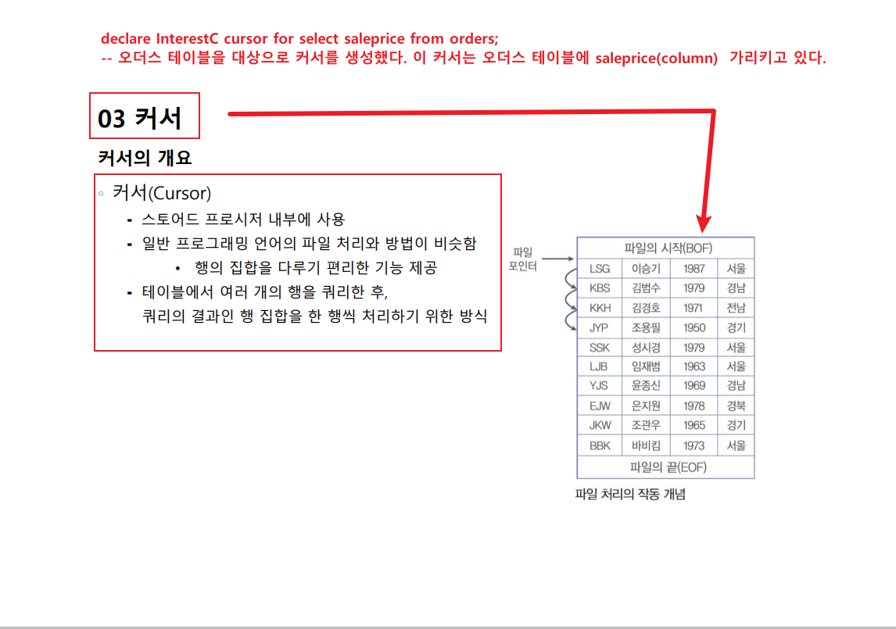
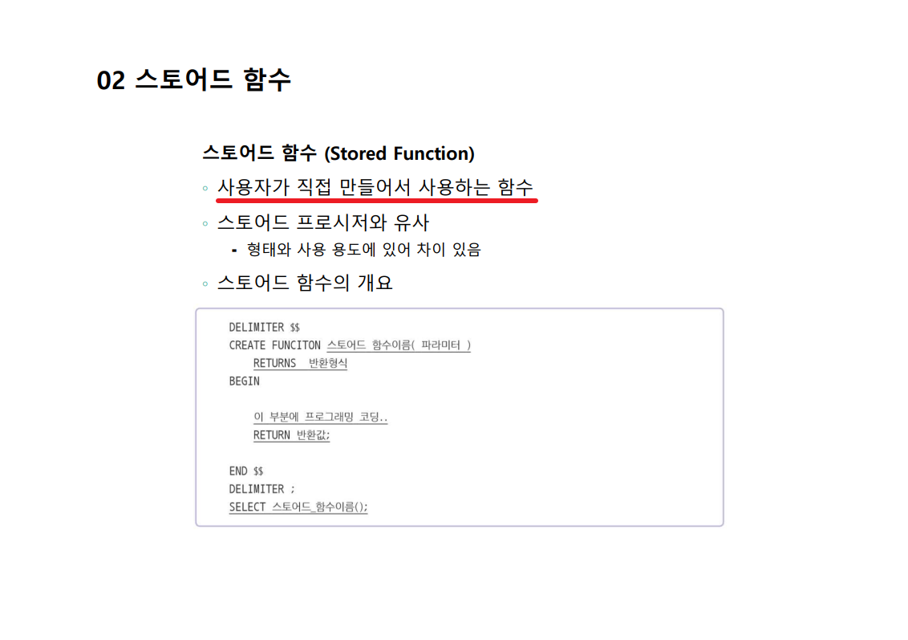
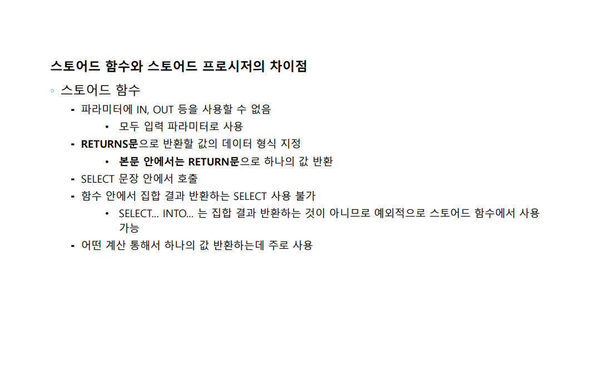
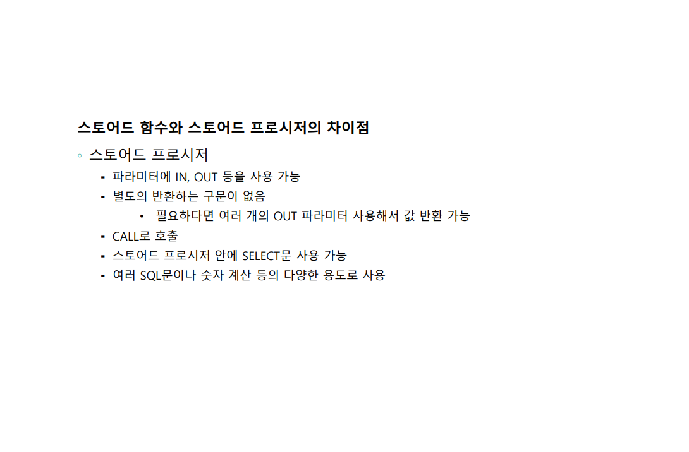
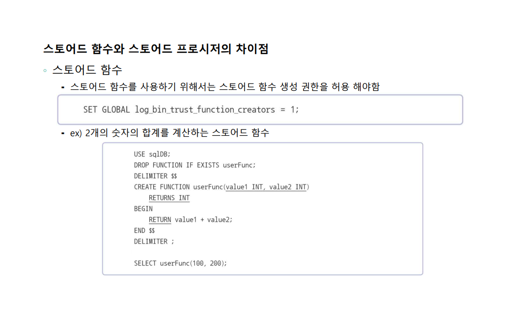
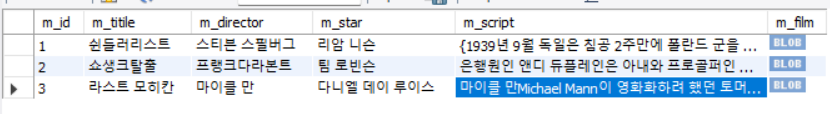

 ## 24년 1월 22일 MYSQL(객체) 심화 수업 
 
## 프로시저  선언 방식 

<details>
<summary>🐝프로시저  🐝    </summary>
<div markdown="1">


 
```SQL
-- delimiter : 구문 종료 기호를 설정 
-- begein - end : 프로그램 문을 블록으로 묶음. {}, 중첨 가능 
-- 조건의 검사 결과에 따라 문장을 선택적으로 수행 :  IF - ELSE 
-- LEAVE 문을 만나기 전까지 반복 : LOOP 라벨을 준다 -> 라벨 : LOOP SQL문 ( LEAVE )  END LOOP ;
-- WHILE문 : 조건이 참일 경우 WHILE문의 블록을 수행 : WHILE (조건) DO SQL문 END WHILE;
-- REPEAT : 조건이 참일 경우 REPEAT 의 블럭을 수행  =>  REPEAT SQL문 선언 방식 => UNTIL(조건) END REPEAT;
-- RETURN : 프로시저를 종료함, 상태값을 반환 RETURN[식]  

-- 예시 ) 
drop procedure whileproc3;
delimiter $$
create procedure whileproc3()
begin 
		declare i INT;
        declare hap INT;
        set i = 1;
        set hap = 0;
        
        mywhile : while(i<=1000) do 
			if(i%3=0) then 
				set hap = i + hap;
				set i = i+1;
				iterate mywhile;
			end if;
			if(i%8=0) then 
				set hap = i + hap;
				set i = i +1;
				iterate mywhile;
			end if;
			set i =i+1;
        end while;
        select hap;
        
end $$
delimiter ;
call whileproc3();

-- -- 오류처리 DECLARE action handler for 오류조건 처리할 문장;

-- action : 오류 발생 시 행동을 정의. continue, exit 둘 중 하나 선택. continue 선택시 제일 뒤의 '처리할 문장'이 처리된다. 
-- 오류조건 : 어떤 오류를 처리할 것인지 지정. SQLEXCEPTION, SQLWARNING, NOT FOUND
-- 처리할 문장 : 한 문장, 처리할 문장이 여러개일 경우 BEGIN 문장들 END


-- 1. 없는 테이블을 찾을 경우의 에러를 대비하는 에러처리 
DROP procedure IF exists errorprc; 
delimiter $$
create procedure errorprc()
begin
	declare continue handler for 1146 select '테이블이 없어용!!!! >.<' as 'message'; -- notable 이라는 테이블을 안만들었기때문에 
    select * from notable;
    
    end $$ 
    delimiter ;
    call errorprc(); -- 프로시저 부르기 

-- 이렇게 오류를 처리할 수 있다 

-- 2. 번쨰 오류 처리
DROP PROCEDURE IF EXISTS errorprc2;
delimiter $$
CREATE PROCEDURE errorprc2()
BEGIN
	SHOW ERRORS;
    SELECT '같은 이름이 있어 작업을 진행할 수 없습니다.' as 'message';
	ROLLBACK;
 END ;
 INSERT INTO usertbl VALUES ('sym1','신세계',1990,'서울', null , null , 178 , current_date());
END $$
 delimiter ;
 call errorprc2();

```

</div>
</details> 

---

## SQL에서의 커서 


<details>
<summary>🐝커서  🐝    </summary>
<div markdown="1">



SQL에서 커서는 데이터베이스 결과 집합을 조작하고 검색하기 위한 개념입니다. 주로 저장 프로시저나 트리거와 같은 데이터베이스 객체에서 사용되며, 데이터베이스에서 쿼리 결과를 한 행씩 처리하는 데에 활용됩니다. 주로 PL/SQL, T-SQL 등의 프로시저 언어에서 커서가 사용됩니다.

간단하게 말하면, 커서는 쿼리 결과를 가리키는 가상의 포인터로 생각할 수 있습니다. 이를 사용하여 특정 테이블이나 쿼리 결과 집합을 반복하면서 개별 행을 가져와서 처리할 수 있습니다.

커서는 주로 다음과 같은 두 유형으로 나눌 수 있습니다:

1. **암묵적(묵시적) 커서(implicit cursor):** 일반적으로 사용자가 명시적으로 선언하지 않고도 SQL 문장을 실행할 때 자동으로 생성되는 커서입니다. 주로 단일 행 쿼리에 사용됩니다.

   예를 들어, 다음은 암묵적 커서를 사용하는 간단한 SQL 문장입니다:

   ```sql
   SELECT column1, column2 FROM table1 WHERE condition;
   ```

   이 쿼리는 암묵적으로 커서를 생성하고, 결과 집합을 반환합니다.

2. **명시적 커서(explicit cursor):** 사용자가 명시적으로 선언하고 제어하는 커서로, 복잡한 쿼리나 다중 행 쿼리를 처리할 때 주로 사용됩니다.

   예를 들어, PL/SQL에서 명시적 커서를 사용하는 간단한 예는 다음과 같습니다:

   ```sql
   DECLARE
       cursor_name CURSOR FOR
           SELECT column1, column2 FROM table1 WHERE condition;
   BEGIN
       OPEN cursor_name;
       FETCH cursor_name INTO variable1, variable2;
       -- 처리 로직
       CLOSE cursor_name;
   END;
   ```

   이 코드에서 `DECLARE` 부분에서 명시적으로 커서를 선언하고, `OPEN`, `FETCH`, `CLOSE` 등의 구문을 사용하여 커서를 열고 데이터를 가져오며 마지막에는 커서를 닫습니다.

커서를 사용하면 데이터베이스 결과를 효과적으로 조작하고 처리할 수 있습니다.


```sql
-- 실습 4. 커서를 사용하여 ORDERS테이블의 판매도서에 대한 이익금을 계산하는 프로시저 : interest.sql
-- 조건 : 도서 가격이 30,000원 이상이면 이익이 10%이고, 30,000미만이면 5%
drop procedure interest;
delimiter // 
create procedure interest()
begin
/*-- 
1. 변수 선언
2. 커서 생성
3. 커서 오픈 
4. 커서 Looping 하면서 Fetch  
5. Loop 종료 
6. 커서 종료 
*/
-- 1. 번수 선언 
declare myinterest integer default 0.0;
declare price integer;
declare endofrow boolean default false;

-- 2. 커서 생성 
declare InterestC cursor for select saleprice from orders; -- 오더스 테이블을 대상으로 커서를 생성했다. 이 커서는 오더스 테이블에 saleprice(column)  가리키고 있다.
declare continue handler for not found set endofrow = true; -- 커서 밑에있어야 한다. 
-- 3. 커서 오픈 
open  InterestC;

-- 4. 커서 Looping 하면서 Fetch  
cursor_loop : loop 
	fetch InterestC into price;
    if endofrow then leave cursor_loop;
    end if;
    if price>=30000 then set myinterest = myinterest + price * 0.1;
	else
    set myinterest = myinterest + price * 0.05;
    end if;
end loop cursor_loop; -- 5. Loop종료 
close InterestC; -- 6. 커서 종료 
select concat('전체 이익금액 =', myinterest);
end;
//
delimiter ;
call interest();
select sum(saleprice) 
from orders;
```
</div>
</details> 

---
# SQL 트리거 


<details>
<summary>🐝트리거 선언방식 및 실습코드 🐝    </summary>
<div markdown="1">

## 선언 방식
```SQL
-- 앞에 이 선언문을 꼭 선언해줘야한다 
SET GLOBAL log_bin_trust_function_creators=on;


delimiter // 
create trigger afterinsertbook after insert on book for each row -- 이 ROW는 변경되는 투플을 말하는것이다. 
begin
declare average integer;
insert into book_log value(new.bookid, new.bookname, new.publisher,new.price);

end;
// delimiter ;

```

```sql
create table book_log(
bookid_log integer,
bookname_log varchar(40),
publisher_log varchar(40),
price_log integer);
select * from book_log;

-- afterinsertbook 트리거 생성하기 

delimiter // 
create trigger afterinsertbook after insert on book for each row 
begin
declare average integer;
insert into book_log value(new.bookid, new.bookname, new.publisher,new.price);

end;
// delimiter ;
insert into book values(20,'아시안컴 축구 우승','대한축구협회',29000);
delete from book where bookid = 20;
select * 
from book
where bookid = 20;
select * from book_log;
select * from book;
```

</div>
</details> 


---
# function(사용자 지정내장함수)

<details>
<summary>🐝실습코드 및 이론  🐝    </summary>
<div markdown="1">






```sql
/*
프로시저는 CALL 명령에 의해 실행되는 독립적인 프로그램 
사용자 정의 함수 : SELECT 문이나 프로시저 내에서 호출되어 SQL문이나 프로시저에 값을 제공하는 용도로 사용 
- 스칼라 함수 : built - in 함수 (단일 값을 돌려주는 함수 ) => sum, max 이나 이런 함수를 말한다. 
*/
-- 1. 판매된 도서의 이익을 계산을 위해서, 각 주문 건별로 실제 판매가격이 saleprice를 입력받아 가격에 맞는 이익 
-- (30000이상 도서는 10% 미만은 5%) 계산하여 반환하는 함수 -- return 타입이 @@ 있어야 한다 
-- function을 만들때 1418에러가 뜬다면 아래 코드를 작성하면 된다. 
set global log_bin_trust_function_creators = on;

delimiter // 
create function fn_interest(price integer) returns integer
begin
	declare myinterest integer;
    if price >=3000 then set myinterest = price * 0.1;
    else set myinterest = price * 0.05;
    end if;
return myinterest;
end 
// delimiter ;
select custid,orderid,saleprice,fn_interest(saleprice) "평균값" from orders;
```
</div>
</details> 


---


<details>
<summary>🐝데이터 타입  🐝    </summary>
<div markdown="1">

MySQL 데이터 타입에 대해서리뷰하는 시간을 가졌음
## 아래 데이터 타입은 외우는것이 좋다 .
- MySQL 데이터 형식

1) 숫자
- SMALLINT (2byte)
- INT (4byte)
- BIGINT (8byte)
- FIOAT (4byte) - 소수점 아래 7자리까지 표현
- DOUBLE (8byte) - 소수점 아래 15자리까지 표현
- DECIMAL(m,d) = m: 전체자릿수 d: 소숫점이하 자릿수
2) 문자
- CHAR(n), CHAR(1) CHARACTER : 고정길이
- VARCHAR(1~65535) : 가변길이
#### TEXT 형식
- TINYTEXT (1~255byte) () -> 저장 가능한 데이터 값
- TEXT (1~ 65535byte)
- LONGTEXT :4G까지 가능
- BLOB형식("Binary Large Object"의 약자) - 사진, 동영상, 및 대용량 글자를 저장하기 위한 데이터 타입
- ENUM() 열거형 데이터 값
- SET
3) 날짜 / 시간
4)
| 키워드      | 데이터 저장값  | 저장형식         |
   |----------|----------|--------------|
| DATE     | 3byte    | YYYY-MM-DD형식 |
| DATETIME | 8byte    | YYYY-MM-DD HH:MM:SS |

4) 지도/JSON 데이터형식
   GEOMETRY :
- 공간데이터 형식으로 선,점, 다각형같은 공간개체를 저장,조작

## JSON(JavaScript Object Notation)
- 선언방식

- **ex) {id: 'jack', name = 'jack Kim', age : 20}**


</div>
</details> 


<details>
<summary>🐝SQL변수 사용해서 테이블에 넣기  🐝    </summary>
<div markdown="1">

SQL 변수 사용 
@ 
```sql
use sqldb;
set @myvar1 ="백정훈은 피곤하다";
set @myvar2 =3;
set @myvar3 =4.2;
set @myvar4 ="가수이름-->";

select @myvar1;
select @mrvar4, name from usertbl where height>180;

set @myvar1 = 5;
prepare myQuery
from 'select name, height from usertbl order by height limit ?';
execute myQuery using @myvar1; 

```
</div>
</details> 

<details>
<summary>🐝제어흐름 함수   🐝    </summary>
<div markdown="1">

```SQL
-- 1. 제어 흐름 함수(수식함수) : 프로그램의 흐름제어 
1-1 .IF(수식, 참, 거짓) 
SELECT IF(100>200,'참','거짓');

-- IFNULL (수식1, 수식2) -> 
수식1이 NULL이 아니면 수식1이 반환, 
수식1이 NULL이면 수식2가 반환

select ifnull(null,'null이구나!'),innull(100,'null이 아니네');

-- NULLIF (수식1, 수식2) : 수식1과 수식2가 같으면 NULL 반환한다. 다르면 수식1 반환 alter
   select nullif(100,100), nullif(200,100);


--2. CASE ~ WHEN ~ ELSE ~ END  : CASE 연산자 다중분기에서 사용되는 함수와 함께 사용된다.
SELECT CASE 10 
         WHEN 1 THEN '일'
         WHEN 5 THEN '오'
         WHEN 10 THEN '십'
         ELSE '에라 모르겠다.'
         END AS 'CASE 연습';  
         

-- 문자열 ASCII(아스키코드), CHAR(숫자) 
SELECT ASCII('A'), CHAR(65);   

-- BIT_LENGHTH(문자열), CHAR_LENGTH(문자열),LENGTH(문자열)  
-- MYSQL 은 UTF-8 코드 이므로 영문자 1= 1BYTE 한글,한문 1= 3BYTE
SELECT BIT_LENGTH('ABC'),CHAR_LENGTH('ABC'),LENGTH('ABC');
SELECT BIT_LENGTH('가나다'),CHAR_LENGTH('가나다'),LENGTH('가나다');

-- CONCAT(문자열1, 문자열2,.... ), CON_CAT_WS(구분자,문자열1, 문자열2)
 -- 각원자 사이에 원하는 원자를 넣는다 (원자와 원자 사이에 원자를 합친다)
SELECT CONCAT_WS('=', '2024','02','21');

-- ELT(위치, 문자열1, 문자열2,...)  -- 위치에있는 원자값을 출력한다. 
SELECT ELT(2,'하나','둘','셋');

-- FIELD('찾을 문자열', 문자열1, 문자열2) -- 인덱스 리턴 해줌 
SELECT FIELD('둘','하나','셋','둘');

-- FIND_IN_SET( 찾을 문자열 , 문자열 리스트) 
SELECT find_in_set('둘','둘');

-- INSTR('하나둘셋','둘'); -- 시작되는 위치 출력
SELECT INSTR('하나둘셋','둘');
-- LOCATE('둘','하나둘셋'); 
 SELECT LOCATE('둘','하나둘셋');
 
 -- FORMAT(숫자, 소수점 자릿수) 
 SELECT FORMAT(12345.1234567,4); -- 소수점아래 4자리수까지 출력 
 
 -- BIN(숫자), HEX(숫자), OCT(숫자), 2진수, 16진수, 8진수 
 SELECT BIN(30), HEX(30), OCT(30);
 
 -- INSERT()
 SELECT INSERT('ABCDEFGHI',3,4,'!!!!'); -- 3은 스타트 위치, 4는지울 문자 크기,!!!!는 넣을 문자 
 SELECT INSERT('ABCDEFGHI',3,2,'!!!!'); 
 SELECT INSERT('ABCDEFGHI',3,1,'!!!!'); 
 SELECT INSERT('ABCDEFGHI',3,0,'!!!!');
 
 -- LEFT(), RIGHT() : 왼쪽, 오른쪽 문자열의 길이만큼 반환 
SELECT LEFT('ABCDEFGHI',8), RIGHT('ABCDEFGHI',8);
SELECT LEFT('ABCDEFGHI',3), RIGHT('ABCDEFGHI',3);
SELECT LEFT('ABCDEFGHI',2), RIGHT('ABCDEFGHI',2);
SELECT LEFT('ABCDEFGHI',1), RIGHT('ABCDEFGHI',1);

-- UPPER(문자열), LOWER(문자열), 대소문자 변환함수 
-- LPAD, RPAD 
SELECT lpad('자바 백엔드 개발자',5,'##'); 
SELECT LPAD('자바 백엔드 개발자',6, '##'); 
SELECT LPAD('자바 백엔드 개발자',10, '##'); 
SELECT LPAD('자바 백엔드 개발자',8, '##'); 
SELECT LPAD('자바 백엔드 개발자',12, '##'); 
SELECT RPAD('자바 백엔드 개발자',12, '##');


-- LTRIM, RTRIM, TRIM() : 공백제거  BOTH : 양쪽  LEADING : 앞 TRALLING :  
SELECT LENGTH(RTRIM('     SQL 프로그래밍')), rtrim('SQL프로그래밍   ');
SELECT TRIM( "   안  녕   " ), TRIM(BOTH '^' FROM '^^ 재미있네요.^^'); -- ^ 다 삭제됨 

-- REPEAT (문자열, 횟수반복)
SELECT REPEAT('SQL',10);
-- SQLSQLSQLSQLSQLSQLSQLSQLSQLSQL

-- REPLACE(문자열,원래 문자열, 바꿀 문자열);
SELECT replace('MYSQL 문법 배우기','문법','저장 프로그램');
-- 이러면 출력이 MYSQL 저장 프로그램 배우기라고 출력이 된다.

          
```
</div>
</details> 


## SQL에 영상과 스크립트자료를 넣고 하는 실습 

<details>
<summary>⛺️ 실습 코드 ⛺️    </summary>
<div markdown="1">


```SQL
create database moviedb;

use moviedb;

create table movietbl(
m_id int,
m_titile varchar(30),
m_director varchar(20),
m_star varchar(20),
m_script longtext,
m_film longblob)
default charset =utf8mb4;

select * 
from movietbl;

insert into movietbl values(1,'쉰들러리스트','스티븐 스필버그','리암 니슨',
load_file('c:/datasource/movies/Schindler.TXT'),
load_file('C:/datasource/movies/Schindler.mp4'));
-- 이렇게 하면 스크립트와 영화가 로드가안되고 널값로 들어가 있다. 
-- 파워쉘로 경로와 용량을 바꿔줘야한다. 
-- 1. 최대 패킷 크기 확인할 필요가 있다. (=최대 파일 크기) 시스템 변수 max_allowed_pack 값 조회 
show variables like 'max_allowed_packet';  -- 기본 값 4M로 설정이 되어있다.

-- 2. 시스템 변수에 secure_ file priv 
show variables like 'secure_file_priv';

insert into movietbl values(1,'쉰들러리스트','스티븐 스필버그','리암 니슨',
load_file('c:/datasource/movies/Schindler.TXT'),
load_file('C:/datasource/movies/Schindler.mp4'));

insert into movietbl values(2,'쇼생크탈출','프랭크다라본트','팀 로빈슨',
load_file('c:/datasource/movies/Shawshank.txt'),
load_file('c:/datasource/movies/Shawshank.mp4'));

insert into movietbl values(3,'라스트 모히칸','마이클 만','다니엘 데이 루이스 ',
load_file('c:/datasource/movies/mohican.txt'),
load_file('c:/datasource/movies/mohican.mp4'));


select * from movietbl; 
commit;
```



- 이렇게 출력문이 뜬다. 
</div>
</details> 


