# 스트림에 대한 공부 

#### 간단한 퀴즈 실습 코드 예제 
- [AggregateEx실습코드](./section3/AggregateEx.java)


#### 자바에서의 스트림에 대해 작성 
1. 스트림이란? -> 데이터의 흐름이다. 
 - 데이터의 흐름(stream) -> 데이터가 여러개가 있어야 흐름을 만들 수 있다. 
 - 스트림 데이터 소스 : 컬렉션, 배열 주로 사용됨 
 - 스트림 데이터는 데이터소스로 부터 추출한 연속적인 데이터 이다.
#### 스트림은 순차적으로 읽는다는것을 꼭 알고있을것 굉장히 중요하다!!!!!! 


스트림 API : 연속적인 데이터의 흐름을 반복적으로 또는 연산하여 처리하는 기능 
 EX) sorted, filter, map, reduce 등등

# 스트림 인터페이스 
### java.util.stream 패키지
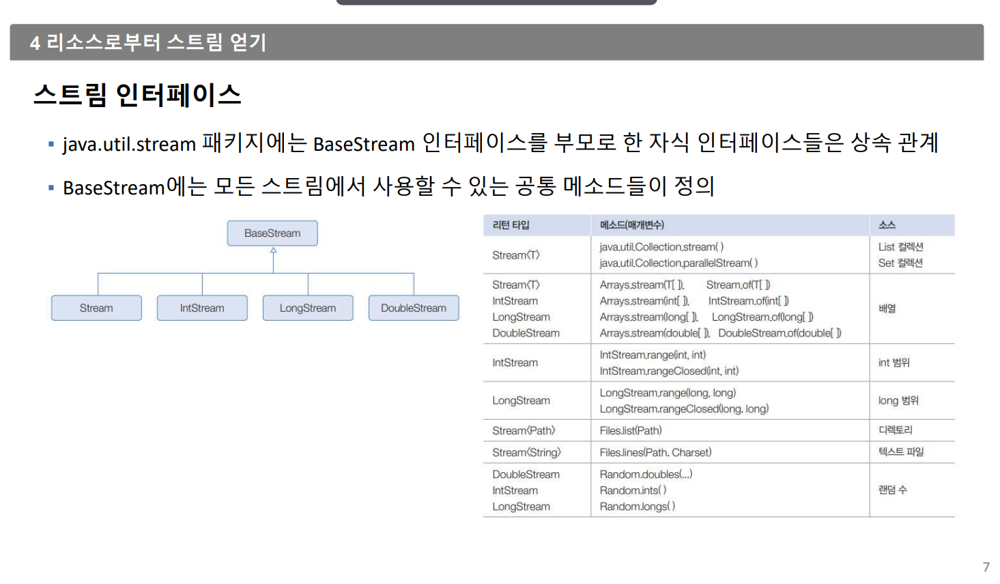
#### 스트림의 특징 (이 부분 굉장히 중요하다)
 - 스트림 연산은 기존 자료를 변경하지 않는다. 
 - 스트림 연산은 중간연산과 최종연산을 구분한다.
 - 한 번 생성하고 사용한 스트림은 재사용할 수 없다. 

2. 중간연산,  최종연산
   
####   중간연산
 - filter() => 조건에 맞는 요소 추출 
 - map() => 조건에 맞는 요소 변환 
 - sorted() => 정렬 
 
#### 최종연산 
스트림의 자료를 소모하면서 연산을 수행한다.
최종연산 이후에 스트림은 더 이상 다른 연산을 적용할 수 없다. 
- foreach() => 요소를 하나씩 꺼내옴 
- count() => 요소 개수 
- sum => 총합 
- average() => 평균(return값은 double)

### 스트림과 Iterator의 차이점
- 내부 반족자이므로 처리속도가 빠르고 병렬처리에 효율적이다.
- 람다식으로 다양한 요소처리를 정의한다
- 중간처리와 최종처리를 수행하도록 파이프 라인이 형성된다.

### 내부반복자
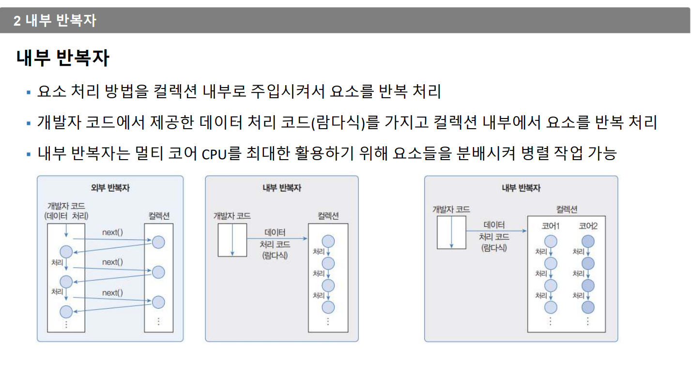

우리가 지금까지 사용하던 포문은 외부 반복자다 

### 중간처리와 최종처리
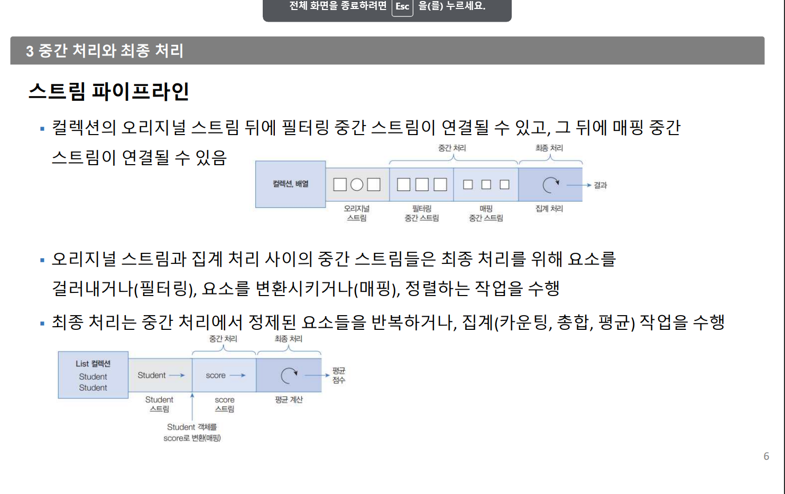
#### 중간처리
- map
 ->mapToInt()은 Java 스트림에서 사용되는 중간 연산자 중 하나입니다. 
  이 메서드는 요소를 특정 방식으로 매핑하여 IntStream을 생성합니다. 
  매핑 함수를 인자로 받아 해당 함수를 각 요소에 적용하고, 
  그 결과를 IntStream으로 반환합니다.

  예를 들어, mapToInt()를 사용하여 스트림의 각 요소를 정수로 매핑할 수 있습니다. 
 이 때, 해당 요소를 정수로 변환하는 방법을 제공해야 합니다. 그 후에 이 IntStream을 활용하여 추가적인 연산을 수행하거나 요소들을 처리할 수 있습니다.
---
매핑이란???? 

매핑(mapping)은 한 데이터 집합의 요소를 다른 형태나 다른 데이터 집합의 요소로 변환하는 것을 의미합니다. 매핑은 각 요소를 가져와서 원하는 형태로 변환하여 새로운 데이터 구조를 만들거나 기존 데이터를 변형하는 작업입니다.

예를 들어, 정수 배열이 있을 때 각 요소를 두 배로 만든 새로운 배열을 생성한다고 가정해보세요. 이 때 각 요소를 가져와서 그 값을 2배로 만들어 새로운 배열을 생성하는 것이 매핑 작업입니다.

Java의 mapToInt() 메서드도 이와 유사한 역할을 합니다. 이 메서드는 스트림의 각 요소를 특정한 방식으로 매핑하여 새로운 IntStream을 생성합니다. 즉, 각 요소를 가져와서 정수로 변환하는 작업을 수행하여 새로운 스트림을 생성하는 것이 mapToInt()의 매핑 작업입니다.


--- 
- filter
- reduce
- sorted 등등


#### 최종처리
- sum()
- average() => return 값이 double으로 지정 된다. 
- forEach() 등등

참고자료 
[link](https://futurecreator.github.io/2018/08/26/java-8-streams/)

---
## 그림으로 다시 정리 

---

#### 리소스로부터 스트림 얻기 
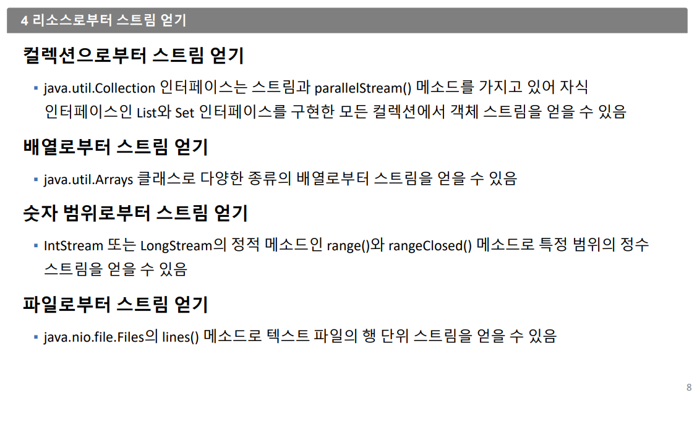

---
#### 요소 걸러내기(필터링)
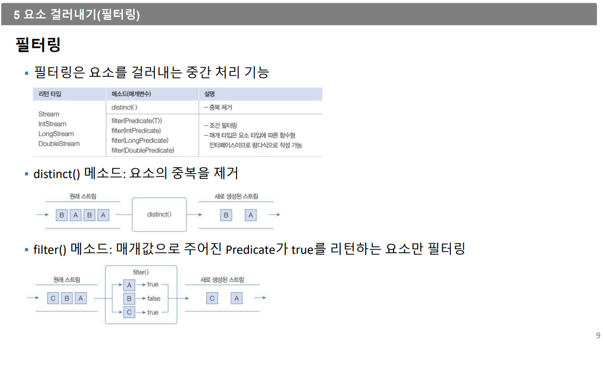

- distinct() : 요소의 중복을 제거
- 
 ## - [실습예제코드](./section3/FilteringEx1.java)


#### Predicate(필터링)
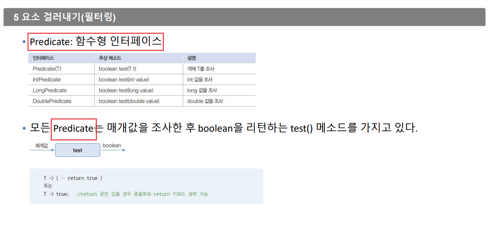
````java

````
---
##### 요소변환 매핑
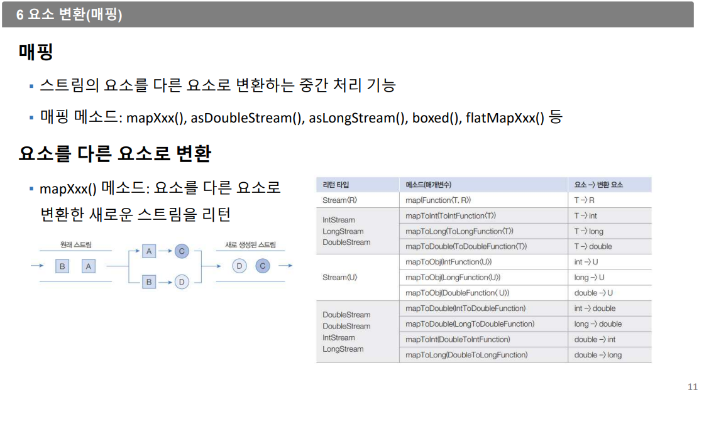
---
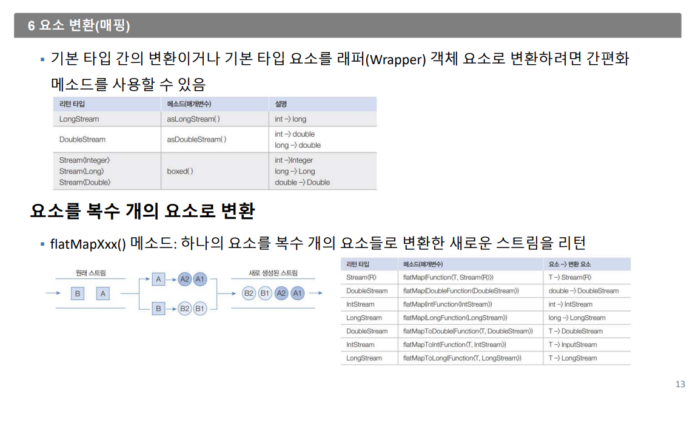

---
## @@@@@요소정렬(Compare)@@@@@@
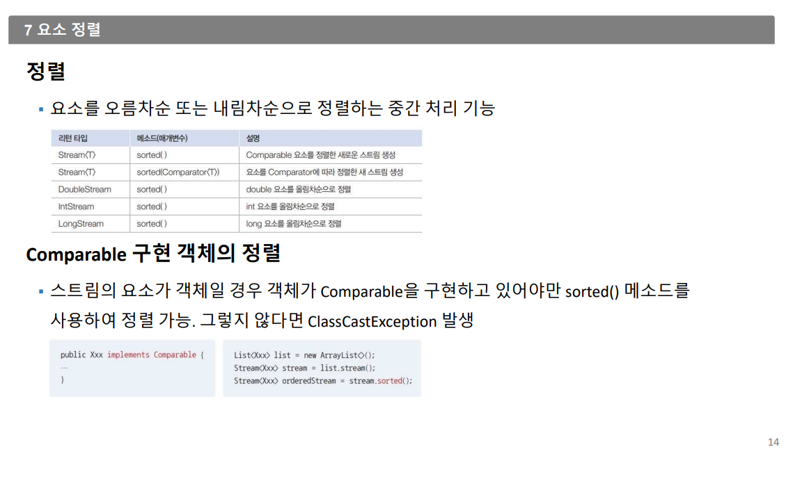
여기 공부 해야함 
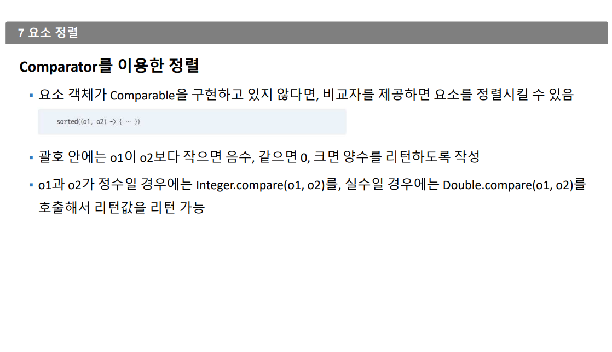
#### 루핑 
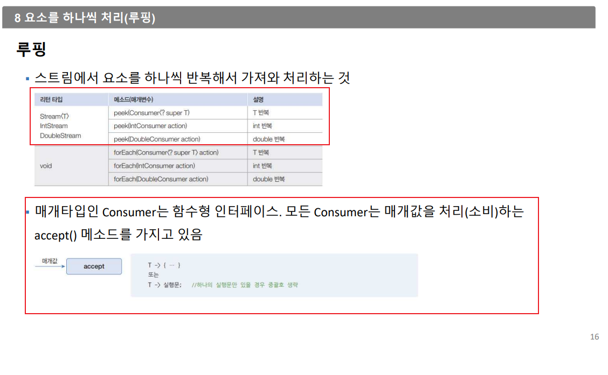

 
- 루핑은 최종연산이다. 
---

#### 매칭
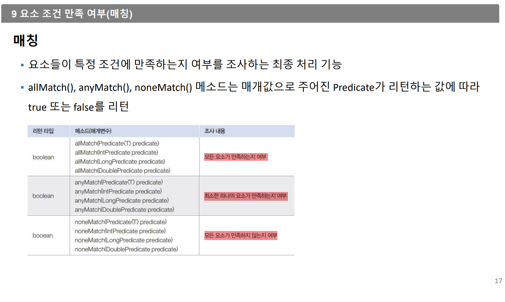

 ## - [실습예제코드](./section3/MatchingEx.java)

---
#### 요소집계기본
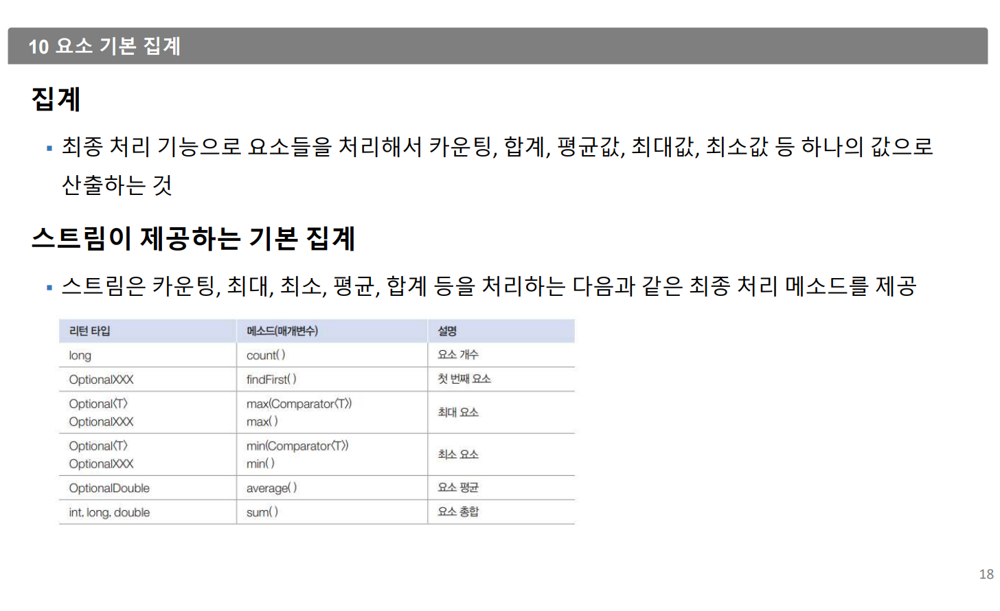

---
#### 요소수집


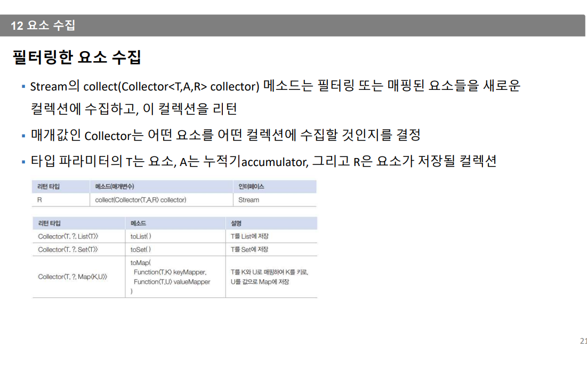
- 스트림은 요소들을 필터링, 매핑한 후 요소들을 수집하는 최종처리 메소드
  collect()제공한다. collect()메소드를 사용하면 필요한 요소만 컬렉션에 담을 수 있고, 요소들을 그룹핑한 후 집계도 할 수 있다.

## - [collect실습예제코드](./collect/CollectionEx.java)
- Steam의 collect(Collect<T,A,R> collector)
 
 위에코드 collector는 어떤 요소를 어떤 컬렉션에 수집할 것인지 결정

 ## Map 도 사용 했다 
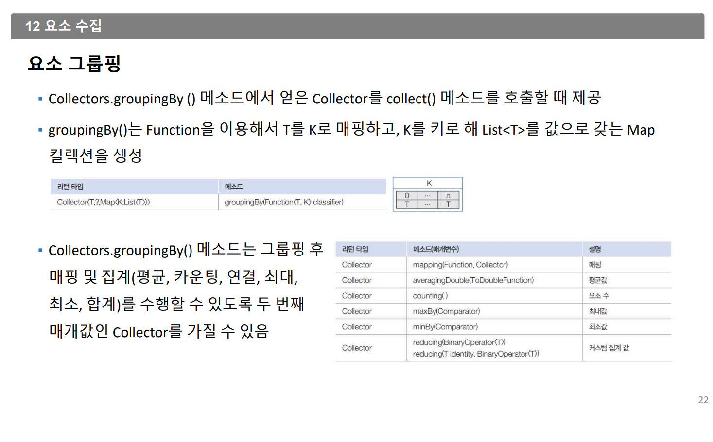