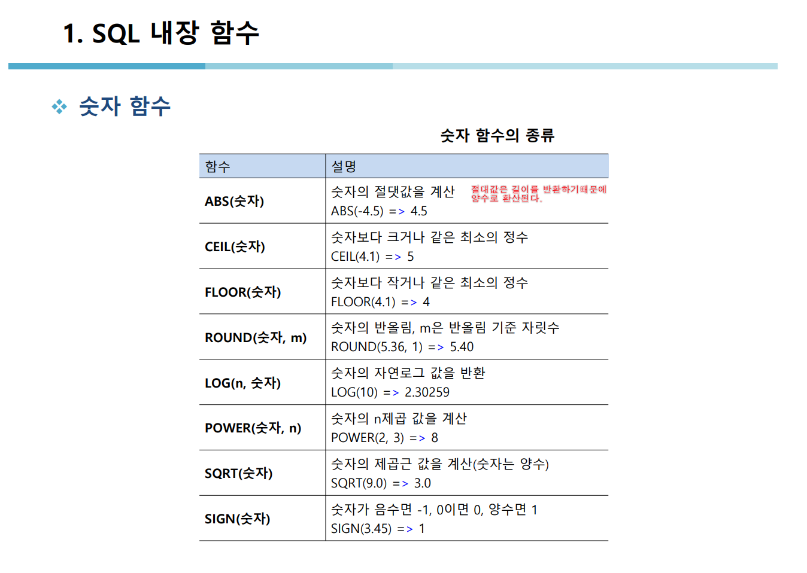
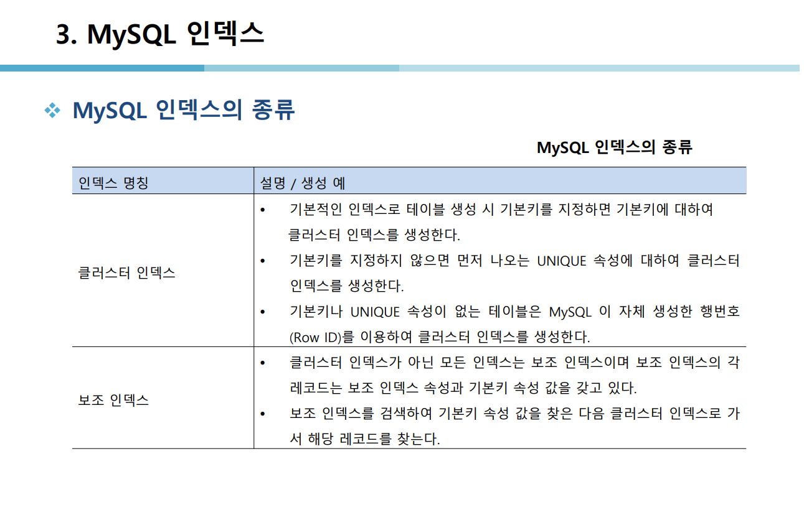

## MYSQL안에서의 함수(즉 API)

## 수업 목표 

- SQL 코드작성에 수훨해지고 적용을 더 빠르게 하기위해서 
    알아두면 유용한 함수들이 많이 있다. 
- 아래 SQL 사이트를 참고해도 API자료가 많아서 좋다

[MYSQL DOCUMENT](https://dev.mysql.com/doc/refman/8.3/en/keywords.html)


### 목차 

<details>
<summary>1. 🐝내장함수 🐝    </summary>
<div markdown="1">


<details>
<summary> 🐝SQL내장함수 🐝    </summary>
<div markdown="1">

1. 내장함수 
2. Null 값 처리 
3. 행 번호 출력 
- 함수 


- 내장함수
1.[x] 모든 내장함수는 최초에 선언될 때 유요한 입력 값을 받아야함  

1.[x] SQL 내장함수는 상수나 속석 이름을 입력 값으로 받아 **단일값으로 결과를 반환한다.**


### 간단한 코드 예시 
```SQL
-- 1. 절대값을 출력하는 키워드 
SELECT ABS(-78),ABS(78);
-- 2. 소수점 반올림 하는 키워드 
SELECT round(4.875,1);
-- 3. 
SELECT CUSTID 고객번호, round(SUM(SALEPRICE)/COUNT(*),-2) 평균금액 
FROM ORDERS
group by CUSTID;
-- 라운드 플로우 셀 시험에 자주 나옴 SQLD


```

- 문자함수 
1.[x] 문자열에 대한 함수를 처리하는 키워드


- 
### 간단한 코드 예시

```sql
-- 서점의 고객 중에서 같은 성을 가진 사람이 몇 명이나 되는지 성별 인원수를 구하시오 

-- SUBSTR은 문자열에서 지정된 자리에서부터 지정된 길이만큼 잘라서 반환 

SELECT SUBSTR(NAME,1,1) '성',COUNT(*) '인원'
FROM CUSTOMER
GROUP BY SUBSTR(NAME,1,1);

```
- 날짜시간함수

### 간단한 코드 예시
```sql
-- 7. 서점은 주문일로부터 10일 후의 매출을 확정한다 각 주문의 확정일자를 구하시오.
SELECT ADDDATE(ORDERDATE, INTERVAL +10 DAY) '주문 확정일자'
FROM ORDERS
WHERE ORDERDATE;

-- 8. 서점이 2014년 7월 7일에 주문 받은 도서의 주문번호, 주문일, 고객번호, 도서번호를 모두 보이시오 
-- 단, 주문일은 '%Y-%m-%d'형태로 표시 
select orderid, date_format(orderdate,'%Y-%m-%d'), custid, bookid from orders;


-- 9. 현재 dbms의 시간을 출력하시오
select sysdate();
```

- 숫자함수
- 
</div>
</details>

<details>
<summary> 🐝NULL 값 처리  🐝    </summary>
<div markdown="1">

### Null 값처리 
- SQL 에서의 Null을 처리하는 방식 

- Null값을 출력하기 싫을때 이런식으로 사용하면 된다. 

```sql
-- 이렇게 하면 전화번호가 없는 사람은 null이 아닌 연락처없음으로 출력이됨

SELECT NAME, ifnull(PHONE,"연락처없음") '전화번호' FROM CUSTOMER;

```
</div>
</details>

<details>
<summary> 🐝행 번호 출력   🐝    </summary>
<div markdown="1">

### 행을 단순하게 출력하기 위한 코드 
```SQL
-- 행 정렬  단순한 출력을 위한 코드  --뒤에는 실행 순서다
-- 포문의 실행 방식과 비슷하다고 생각하면 될듯하다. 
SET @SEQ:=0;  -- 1번 
SELECT (@SEQ:=@SEQ+1) '순번', CUSTID, NAME, PHONE -- 4번 
FROM CUSTOMER -- 2번 
WHERE @SEQ <=2; -- 3번 
```


</div>
</details>

</div>
</details>

<details>
<summary>2. 🐝뷰   🐝    </summary>
<div markdown="1">


🐝뷰의 생성 및 수정 삭제  🐝 

1.[X] 뷰의 생성에 대한 코드 및 설명 


1.[X] 뷰를 수정에 대한 코드 및 설명 


create or replace view 뷰명


## 위의 내용을 참조한 실습 코드 
```sql
-- VW_BOOK1 VW를 만드는 코드 
create view vw_book1
as
select *
from book
where bookname like '%축구%';

-- VW_BOOK1 조회 코드 

select * 
from vw_book1;

-- #####20번 대한민국을 포함한 고객을 뷰를 만들기 

-- VW_CUSTOMER 뷰 만드는 코드  
create or replace view vw_customer
as select* 
from customer 
where address like "%대한민국%";
select * 
from vw_customer;

-- #######21 번 오더테이블에 고객이름과 도서이름을 바로 확인할 수 있는 뷰를 생성한후
'김연아' 고객이 구입한 도서의 주문번호,도서이름,주문액을 보이시오


create view o_orders(orderid,custid,name,bookid,bookname,saleprice,orderdate)
as 
select od.orderid, od.custid,cs.name,od.bookid,bk.bookname,od.saleprice,od.orderdate
from orders od, customer cs, book bk
where od.custid = cs.custid and od.bookid = bk.bookid;

select orderid, bookname, saleprice from o_orders where name ="김연아";

-- 수정가능한 뷰 생성  or replace 
create or replace view o_orders(orderid,custid,name,bookid,bookname,saleprice,orderdate)
as 
select od.orderid, od.custid,cs.name,od.bookid,bk.bookname,od.saleprice,od.orderdate
from orders od, customer cs, book bk
where od.custid = cs.custid and od.bookid = bk.bookid;

select orderid, bookname, saleprice from o_orders where name ="김연아";

-- ######22번 20번의 뷰를 영국을 포함한 주소를 가진 고객으로 변경하시오 
create or replace view vw_customer(custid, name, address)
as select custid, name, address
from customer 
where address like '%영국%';
select * 
from vw_customer;

drop view o_orders;

-- 만든 뷰 들은 시스템 사탈로그에 저장이 된다. 
-- 문제풀이 


create or replace view highorders(bookid,bookname,name,publisher,price)
as
select b.bookid,b.bookname,c.name,b.publisher,b.price
from book b, customer c, orders o
where o.custid = c.custid and o.bookid = b.bookid and price>=20000;
select * 
from highorders;

select bookname, name 
from highorders;

create or replace view highorders(bookid,bookname,name,publisher)
as
select b.bookid,b.bookname,c.name,b.publisher
from book b, customer c, orders o
where o.custid = c.custid and o.bookid = b.bookid;

select *
from highorders;

```


</div>
</details>

<details>
<summary>3.  🐝 인덱스   🐝    </summary>
<div markdown="1">





</div>
</details>