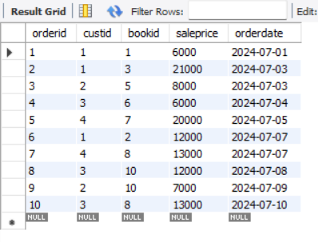
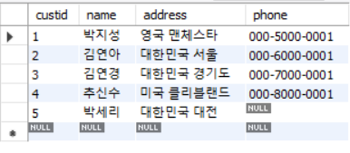
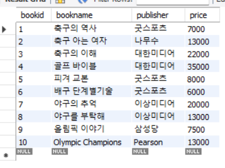
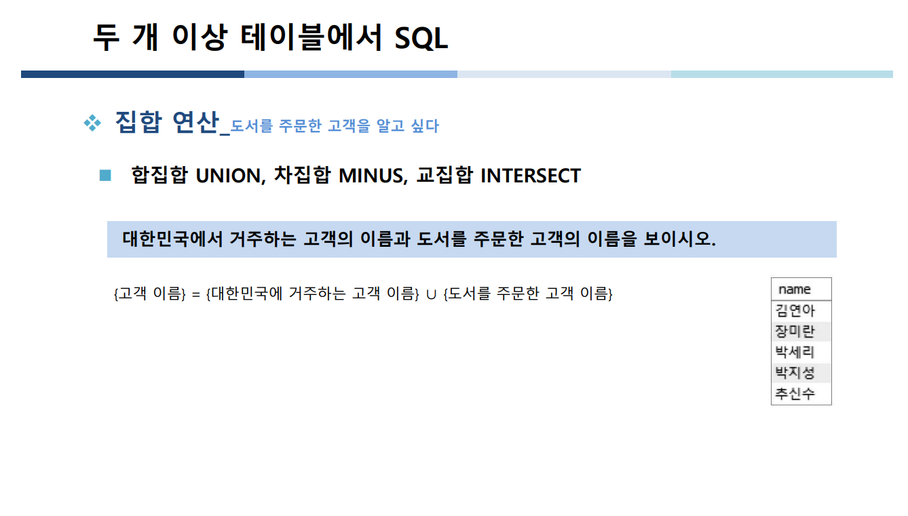
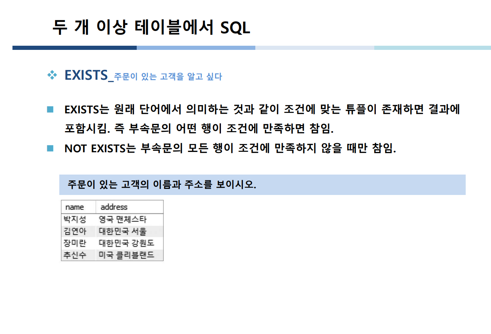
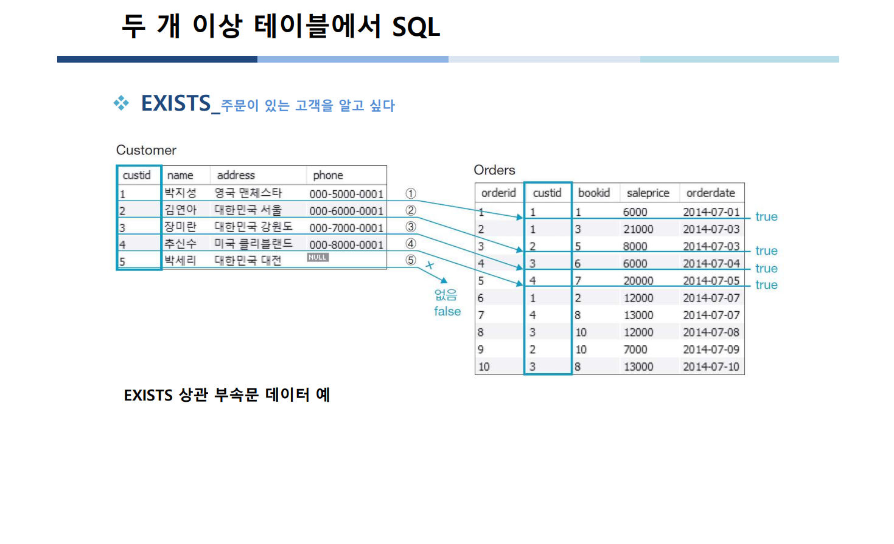

## 1월 18일 
## DML(Data Manipulation language) 데이터 조작어 
## Join

-- 실습 코드로 작성 


- 조인이란 한 테이블의 행을 다른 테이블의 행에 연결하여 두 개 이상의 테이블을 결합하는 연산이다.
- 기본 개념 
```sql
select count(*)
from customer;
select count(*)
from orders;
select count(*)
from orders,customer;
 -- 이러면 투플의 갯수는 50개다 
```

## 테이블 3가지 orders,customer,book
1. orders테이블

   
2. customer테이블

   
3. book테이블

   

---
## 쿼리문제 
<details>
<summary>쿼리 실습코드   </summary>
<div markdown="1">
1. 고객과 고객의 주문에 관한 데이터를 모두 보이시오 
```sql
select * 
from book b, customer c , orders o
where c.custid = o.custid and b.bookid = o.bookid;

```

2. 고객과 고객의 주문에 관한 데이터를  고객 번호 순으로 정렬하시오 

```sql
select *  -- 3번     ※코드를 읽는 순서 
from book b, customer c , orders o --1번 
where c.custid = o.custid and b.bookid = o.bookid; -- 2번
order by o.custid; -- 4번 
 
```

3. 고객의 이름과 고객이 주문한 도서의 판매가격을 검색하시오 
```sql
 select name , saleprice
from customer c , orders o 
where c.custid = o.custid;

```
4. 고객별로 주문한 모든 도서의 총 판매액을 구하고 고객별로 정렬하시오 그리고 나서 이름순으로 정렬 
```sql
elect name, sum(saleprice) "총 판매액"
from customer c , orders o
where c.custid = o.custid 
group by c.name
order by c.name;


```


5. 고객의 이름과 고객이 주문한 도서의 이름을 구하시오 
```sql
select name, bookname
from customer c, book b, orders o
where c.custid = o.custid and b.bookid = o.bookid;
```

6. 가격이 20000원 이상인 도서를 주문한 고객의 이름과 도서의 이름을 구하시오 
```sql
select name,bookname
from customer c, book b, orders o
where c.custid = o.custid and b.bookid = o.bookid and b.price =20000;

```
7. 도서를 구매하지 않은 고객을 포함하여 고객의 이름과 고객이 주문한 도서의 판매가격을 구하시오
1. [x] 새로운 개념 도입 **left outer join** 테이블명 on 테이블명 = 테이블명 
### 외부조인 ★★★★outer join★★★★
외부조인은 데이터베이스에서 두 테이블을 연결할 때 사용되며, 연결 조건을 충족하지 않는 행도 결과에 포함시킵니다. 세 가지 주요 유형이 있습니다.

1. [x] **왼쪽 외부조인(Left Outer Join):**
    - 왼쪽 테이블의 모든 행을 포함하며, 오른쪽 테이블에서 일치하는 행이 없으면 **NULL 값으로 채웁니다**.

2. [x] **오른쪽 외부조인(Right Outer Join):**
    - 오른쪽 테이블의 모든 행을 포함하며, 왼쪽 테이블에서 일치하는 행이 없으면 **NULL 값으로 채웁니다**.

3. [x] **전체 외부조인(Full Outer Join):**
    - 양쪽 테이블 중 어느 한 쪽에도 일치하는 행이 없어도 **모든 행을 결과에 포함시킵니다**.

외부조인은 두 테이블 간의 관계를 조사하거나 필요한 데이터를 가져올 때 사용됩니다. 결과에는 일치하는 행과 일치하지 않는 행이 모두 포함되어 있습니다.

```sql
select c.name , o.saleprice
from customer c, orders o
where c.custid = o.custid;

```

8. 가장 비싼 도서의 이름을 검색 하시오 (Subquery작성해서)
 - max(속성)집계함수 사용 
```sql
select bookname
from book
where price = (select max(price) from book);
```
9. 도서를 구매한 적이 있는 고객의 이름을 검색 하시오
- ?? 다시한번 볼것 
```sql
select c.name
from customer c
where custid in (select custid from orders);

```
10. 대한 미디어에서 출판한 도서를 구매한 고객의 이름을 보시오
```sql
select name
from customer c, order o, book b
where b.publisher = '대한미디어' and o.custid = 
 
-- 나는 이렇게 하려고 했는데 
-- 더 간단한 코드가 있었다.
select name 
from customer 
where custid in(
select custid from orders where bookid in(
select bookid from book where publisher = '대한미디어'));
```

11. 출판사별로 출판사의 평균도서 가격보다 비싼 도서를 조회하시오
- 이건 조인으로 풀기 힘들다 
- 하위 부속질의가 있어야 한다.
- 책에 대한 부속질의를 구해야 한다.
```sql
select b1.bookname
from book b1
where b1.price > 
(select avg(b2.price) from book b2 where b2.publisher = b1.publisher);

```
 - 여기서는 출판사의 평균도서가격이 없기 때문에 즉, 그 조건이 없이 때문에 
 그것에 대한 데이터를 새로 만들어서 추력을 하기 위해서 상위부속,하위부속을 만든것이다. 

</div>
</details>

---
## 집합연산 
### 

<details>
<summary>🐝집합연산 실습코드🐝    </summary>
<div markdown="1">

1. 대한민국에서 거주하는 고객의 이름과 도서를 주문한 고객의 이름을 보이시오.

```sql

select name '대한민국에서 거주하는 고객의 이름', name '도서를 주문한 고객의 이름'
from customer 
where address like '대한민국%' and name in
(select name from customer where custid in(select custid from orders));
```

2. 대한민국에서 거주하는 고객의 이름에서 도서를 주문한 고객의 이름을 뺴고 조회하시오
```sql
select name 
from customer 
where address like '대한민국%' and name not in
(select name from customer where custid in(select custid from orders));

```

3. 대한민국에서 거주하는 고객중 도서를 주문한 고객을 조회하시오
```sql
select name 
from customer 
where address like '대한민국%' and name in
(select name from customer where custid in(select custid from orders));


```


</div>
</details>

### EXISTS

- EXISTS_ 주문이 있는 고객을 알고 싶다 
1. [X] EXISTS는 원래 단어에서 의미하는 것과 **같은 조건에 맞는 튜플이 존재하면 결과에 포함시킴**. 즉 부속문의 어떤 행이 조건에 만족하면 참임.
2. [X] NOT EXISTS는 부속문의 모든 행이 **조건에 만족하지 않을 때만 참임**.



### 그림예시 



### 실습 코드 
1. 주문이 있는 고객의 이름과 주소를 조회 하세요 
```sql
select name, address from customer c 
where exists (select * from orders o where c.custid = o.custid);
```


