# 멀티스레드 

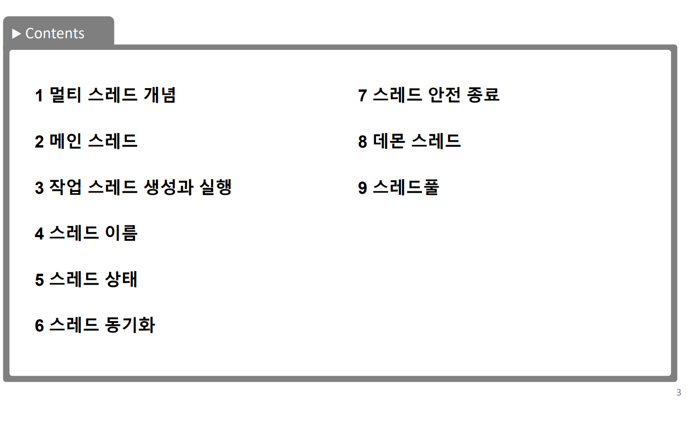

### 멀티스레드의 개념


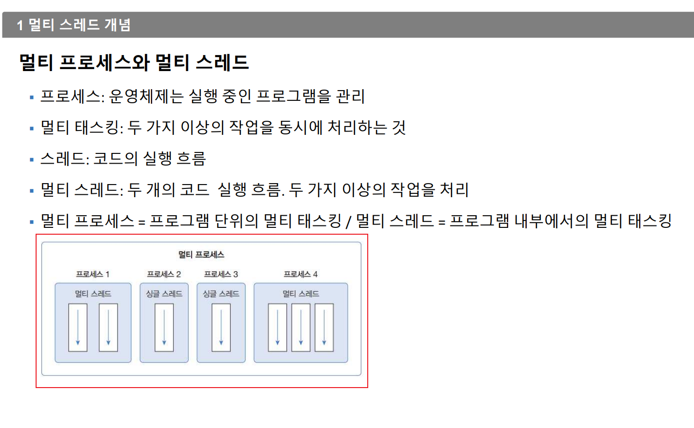


- 프로세스 : 운영체제는 실행 중인 프로그램을 관리
- 멀티 태스킹 : 두 가지 이상의 작업을 동시에 처리하는 것
- 스레드 : 코드의 실행 흐름
- 멀티 스레드 : 두 개의 코드 실행 흐름. 두 가지 이상의 작업을 처리
- 멀티 프로세스 : 프로그램 단위의 멀티 태스킹 /
- 멀티 스레드 : 프로그램 내부에서의 멀티 태스킹


<span style="color:red"> 수업 전 강사님 말씀 </span>

<span style="color:red">용어</span>에 대해서 설명을 할줄알아야 한다.
기본 개념 및 키워드의 중요성
why?라는 질문에 답을 해야할줄 알아야 한다.

지금부터 위에 키위드를 하나하나 정리해보겠다.

 ## 프로세스란?
 무엇인가?를 알려면 운영체제(OS)를 알아야 한다.하지만 한줄로 표현하자면 
 - 실행중인 프로그램 

## 운영체제란 ? 
- 자원을 효율적으로 운영 및 관리 하는 소프트 웨어 


- 운영체제(OS, Operating System)는 컴퓨터 시스템의 핵심 소프트웨어로, 컴퓨터 하드웨어와 소프트웨어 간의 상호작용을 관리하고 제어하는 역할을 한다.
- 운영체제의 목적은 2가지로 설명할 수 있다.
---
 ## 태스크란? 
 - 작업 
  ---

 ##### 즉, 사용자로 하여금 컴퓨터를 원활하게 사용할 수 있게 인터페이스를 제공한다. 


1. 운영을 목적으로한다
- 소프트웨어와 하드웨어사이에 운영을 원활하게 할 수 있게 하는 것이 목적
2. 관리를 목적으로 한다
 - 리소스(소프트웨어,하드웨어)를 관리해 준다.

---

## 멀티 태스킹이란?
 - 두 가지 이상의 작업을 동시에 처리하는 것
 - 운영체제가 멀티 프로세스를 생성해서 처리해 준다( 반드시 멀티태스킹이 멀티프로세스를 의미하지는 않는다.)
  위에 말은 멀티 태스킹이 멀티프로세스와 무조건 똑같다고말하기는 힘들다는 뜻이다. 
### 하지만 비슷하다고는 할 순 있다. 차이점에 대해서 한 번 찾아보자.
 - 하나의 프로세스에서 멀티태스킹을 할 수 있도록 만든 대표적인 프로그램 : 채팅
 - 매신저프로그램은 채팅 작업을 하면서 동시에 파일전송이나, 선물하기, 연락처 전송하기, 초대하기 
 - 하나의 프로세스가 두 가지 이상의 작업을 처리할 수 있는 것은 멀티스레드 때문이다.
 스레드란 코드의 실행 흐름인데 프로세스 내에 스레드가 두개라면 두개의 코드 실행 흐름이 생기는 것이다.
 - 멀티프로세스는 프로그램 단위의 멀티 태스킹
 - 멀티스레드는 프로그램 내부에서의 멀티 태스킹 
---
## 스레드 와 멀티 스레드 및 멀티 프로세스 
- 그림참조 
- 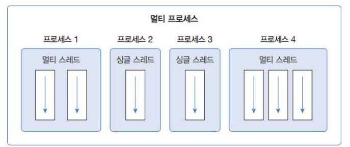

- 스레드<span style="color:red"> (프로그램or프로세스 내부에 존재or내부에서 실행되는것)</span> : 코드의 실행 흐름
- 멀티 스레드 : 두 개의 코드 실행 흐름. 두 가지 이상의 작업을 처리
- 멀티 프로세스 : 프로그램 단위의 멀티 태스킹 
- 멀티 스레드 : 프로그램 내부에서의 멀티 태스킹

-> 독립적으로 서로간의 상관없이 자기만의 흐름을 끝까지 지켜나가는것을 스레드라고 칭한다.
  ex) 카카오톡안에서 문자를 보내는채팅에서 선물하기,이미지보내기, 연락처보내기
  이런것들이 각각의 독립적인 프로세스다? (확실하진 않음)아직은 

### 위에 개념 절대 해깔리면 안된다. 확실하게 분리해서 이해해야한다. 

---
지금부터 스레드에 대해 디테일하게 설명을 하겠다. 
### 메인스레드 
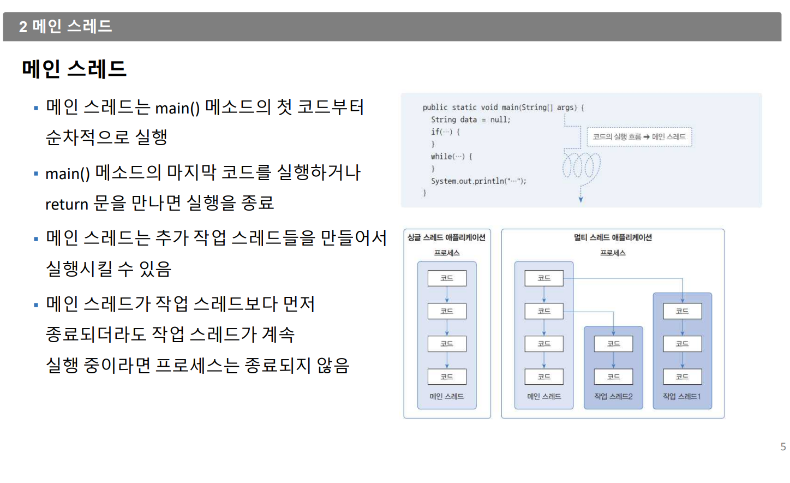
- 자바는 메인이 무조건 먼저고 시작이다. 
- 지금까지 우리의 모든 수업은 싱글 스레드로 수업을 한것이다.
- 메인이 작업 스레드를 실행을 시켜주더라도 각자도생하는것으로 생각하면된다.
 시작과 끝은 전혀 상관없다. 
 그냥 코드로 실행을 시켜주는것 뿐 그 이상 그 이하도 아니다 
### 작업스레드
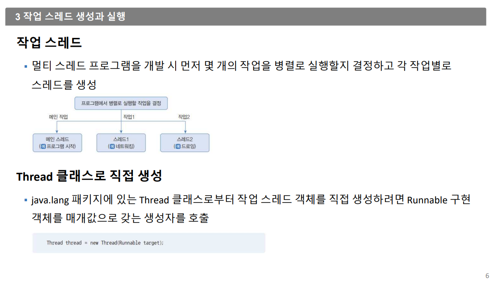

#### 스레드 생성 방법 
1. Thread 클래스
 - 1-1.java.lnag.Thread 클래스로부터 작업스레드 객체를 직접 생성 

Thread thread = new Thread(Runnable target);
- 그림참고 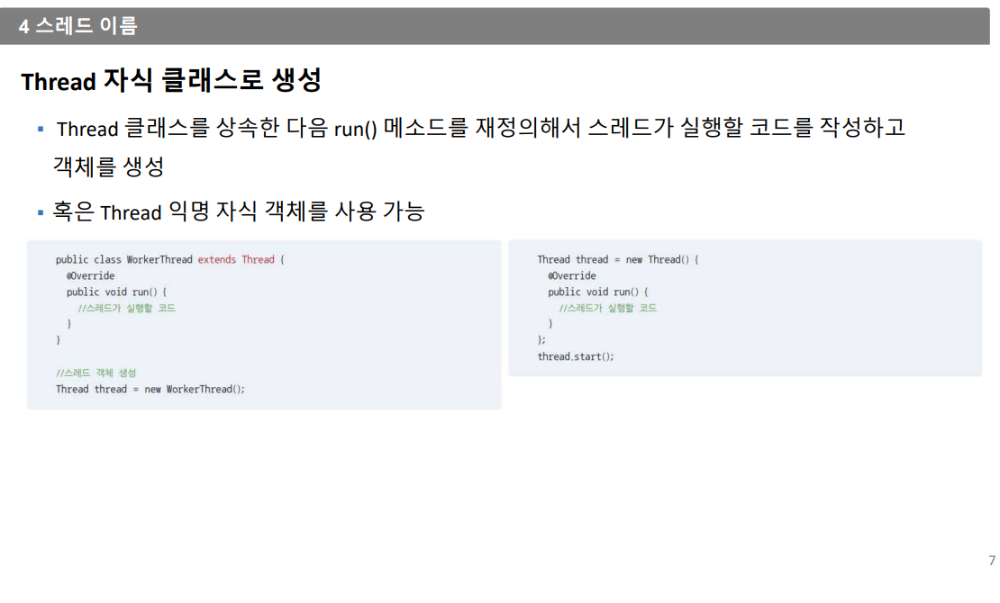

Runnable스레드가 작업을 실행할때 사용하는 인터페이스 구현 클래스는 run()을 재정의(overring)하여 스레드가 실행할 코드를 작성한다. 
        
 - 1-2.java.lnag.Thread 클래스를 상속받아 생성
2. Runnable 인터페이스 : run()

쓰레드는 운영체제위에서 동작이 되고 
운영체제는 cpu 메모리 위에서 동작이 된다. 
그리고 그것을 스케쥴러를 이용해서 동작이 된다. 
단, 자바는 JVM이라는 독립적인 기능위에서 동작이 가능하다. 
---
### 아래는 자바에서의 쓰레드에 대한 설명이다.
자바는 클래스 하나당 JVM이 할당된다. (즉, 쓰레드 하나당 하나의 JVM이 할당된다.)
(JVM은 API를 공급을 해주기도한다)
자바에서는 프로세스가 따로 존재하지 않는다. 

- 프로세스 = 프로그램 + 프로세스제어블록 
- 프로세스는 독립된 메모리 영역을 할당 
- 그림참고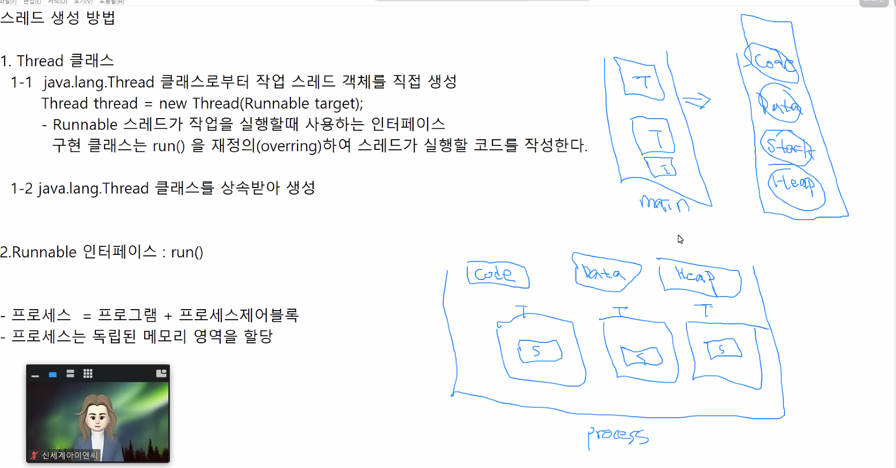
- 위에 그림을 잘봐라 
- 스레드는 자신만의 스텍을 갖고 있다. 하지만 힙영역은 공유한다. 
- 출력되는 순서는 중요하지 않다. 스레드는 각자 진행된다. 
-그림참고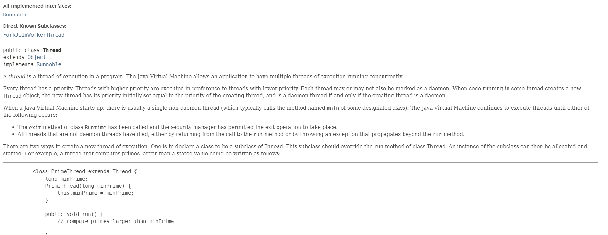
위에 API에 있는 내용이 최고의 핵심내용이다. 

[쓰레드API](./https://docs.oracle.com/en/java/javase/17/docs/api/java.base/java/lang/Thread.html)

쓰레드 실행 기본 코드 
```
 class PrimeThread extends Thread {
         long minPrime;
         PrimeThread(long minPrime) {
             this.minPrime = minPrime;
         }

         public void run() {
             // compute primes larger than minPrime
              . . .
         }
     }
```
[쓰레드관련 무조건외워야하는API링크](./https://docs.oracle.com/en/java/javase/17/docs/api/java.base/java/lang/Thread.State.html)

### 위에 총 6가지 무조건 외워야한다. 

---
## 스레드상태 !!!!!!!(중요!!!!!!!!!!)
- 그림참고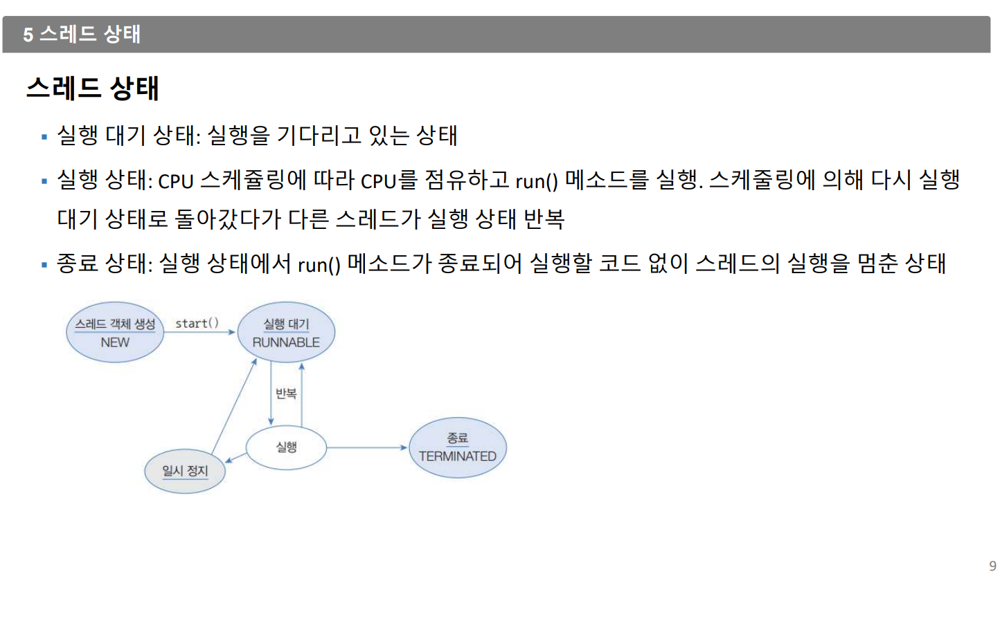
스레드의 7단계 와 상태
- new 생성
- runnable 실행
- running 실행상태  -> state가 없다
- waiting 대기 -> 굉장히 많이 사용한다
- timed_waiting 일시정지?
- blocked 멈춤
- terminated  종료
- 실행대기상태는 실행을 기다리고있는 상태다 그 상태는 CPU를 타고 놀고 있다가 RUN메소드가 실행되면 Running을 한다고 생각하면된다.
- 수업때 슬립과 삐를 반복했던것은 실행대기 -> 실행 -> 일시정지or실행대기 이 과정을 반복한것이다. 절대 일시정지에서 실행으로 바로 갈 수 없다.
일시정지는 실행으로 갈 수 없고 실행으로 가려면 실행대기로 갔다가 실행으로 가야한다.이과정에서 사용되는 코드는 아래의 그림을 보면된다.
- 일시정지상태란? -> 스레드가 실행할 수 없는 상태 
- 그림참고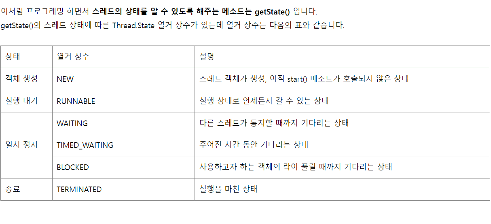
#### 그림참고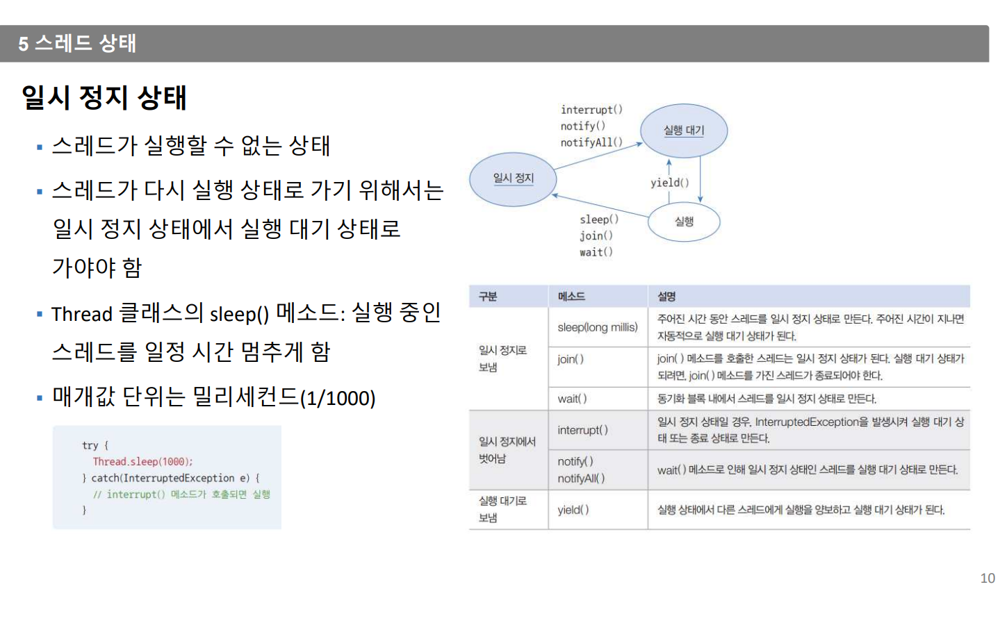
1. 러닝에서 러너블에서 보내는 메소드

        `yeild 양보 -> 실행중인 스레드를 다른 스레드로 양보하는것이다`


2. 러닝에서 일시정지로 보내는 메소드 3개

        wait -> 일시정지상태로 보내는것 . 동기화 블럭에서 일시정지하는것 . nofify하기전까지는 다시 돌아갈 수 없다.  
            
        join -> join()메소드를 호출한 스레드는 일시정지 상태가 된다. 실행대기 상태가 되려면 join() 메소드를 가진 스레드가 종료되어야 한다.
            
        sleep -> 주어진 시간동안 러너블상태로 멈추는것 // 주어진 시간이 지나면 자동적으로 실행 대기상태가 된다.


3. 일시정지에서 벗어나는 메소드 3개 실행대기로갈수밖에 없다.

        notify -> wait되어있는 쓰레드를 풀어주는것
        
        notifyall -> wait되어있는 모든 쓰레드를 모두 풀어주는것
        
        interrupt -> InterruptException을 발생시켜서 실행대기상태를 만들거나 종료상태를 만든다.

### 위 그림 및 아래코드는 무조건 외워야 한다 (다른언어도 똑같다)
일시정지에서 벗어나는 코드
- interrupt()
- notify()
- norifyall()

일시정지로 보내는 코드 
- sleep(long millis)
- join()
- wait()
실행대기로 보냄
- yield() -> 양보하는 느낌 


#### 그림참고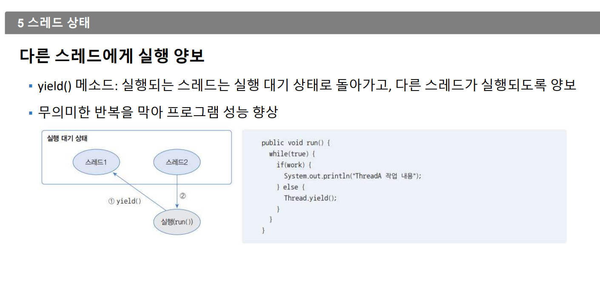
- yield() 옐드메소드 : 실행되는 스레드는 실행 대기 상태로 돌아가고, 다른 스레드가 실행되도록 양보
- 무의미한 반복을 막아 프로그램 성능 향상 
---
## 프로세스란? 
    프로세스는 독립된 메모리 영역을 할당
    프로세스 상태 전이란? 
    프로세스가 실행하는 동안 상태가 OS에 의해 변경되는것 
    
    운영체제
    프로세스의 상태를 감시 
    프로세스 상태를 기반 프로세스 스케쥴링 
    -프로세스를 관리하고 제어한다.
    생성(new)---(Admitted)--->준비(Ready): 프로세스 생성을 승인받음 
    준비(Ready,Runnable)----Dispatch--->실행(Running) : 준비상태에 있는 여러 프로세스 중 하나가 스케쥴러에 의해 실행 
    실행(Running)----interrupt---->(Ready,Runnable): Timeout, 이벤트가 발생해서 현재 실행중인 프로세스(쓰레드)가 준비상태로 전환되는것
    실행(Running)--->waiting : 실행중인 프로세스가 입출력이나 이벤트에 의해 대기해야 하는경우, 입출력이나 이벤트가 끝날때까지 대기해야 하는 경우 
    waiting --> Ready : 다시준비 상태로 만들어서 스케쥴러에 의해 선택될 수 있도록 상태전환

Os스케쥴러한테 인증번호를 받고 그것이 PID값(IDEA값)이다 .
프로세스 컨트롤 블럭(PCB)
스케쥴러가 따로 존재 하고 스케쥴러 기법이 따로 있다. 
## 위에 과정은 운영체제(OS)가 프로세스를 스케쥴링(계획)하는과정
 

---

## 오늘 오전 수업은 쓰레드이론은 여기서끝이고 이거 무조건 알고있어야 한다.오후에는 이제 코드로 작성 시작 

## 여기 코드 파일 올릴장소 

--- 
## 스레드동기화 

- 그림참고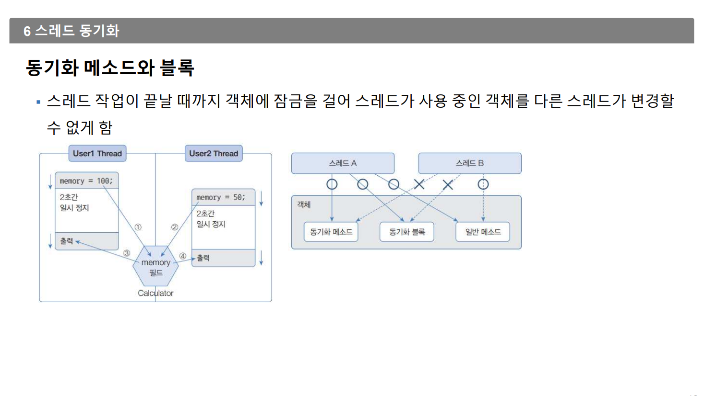
스레드는 작업이 끝날 때까지 객체에 잠금을 걸어 스레드가 사용 중인 객체를 다른 스레드가 변경할 수 없게 한다 

### 동기화 메소드 및 블록 선언
- 인스턴스와 정적메소드에 synchonized(씽크로나이즈드)키워드 붙임 
- 동기화메소드를 실행 즉시 객체는 잠금이 일어나고, 메소드실행이 끝나면 잠금 풀림 
- 메소드 일부 영역 실행 시 객체 잠금을 걸고 싶다면 동기화 블록을 만듬 
