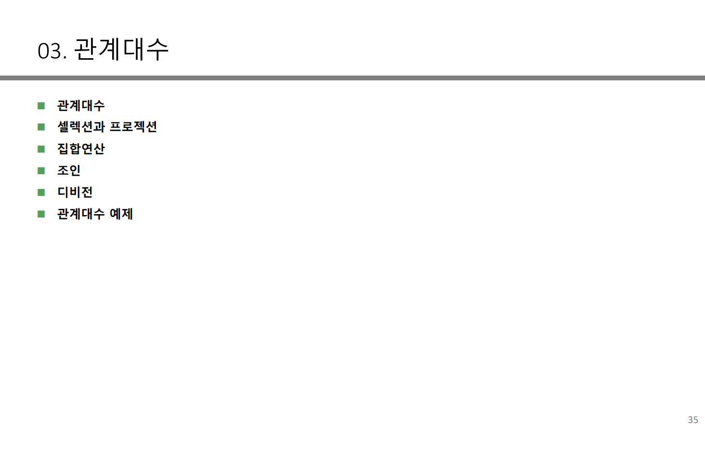
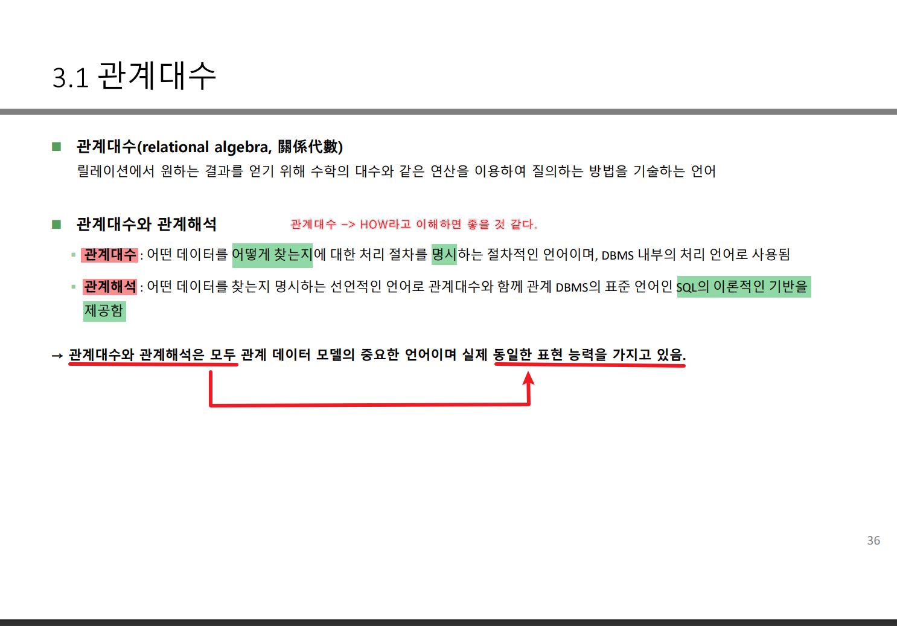
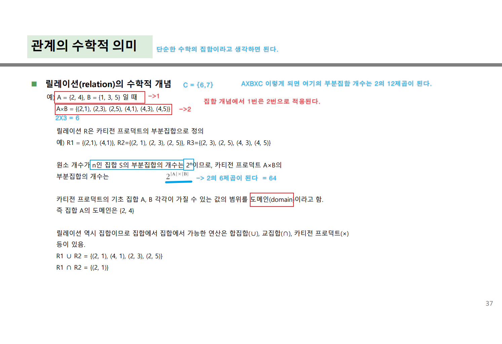
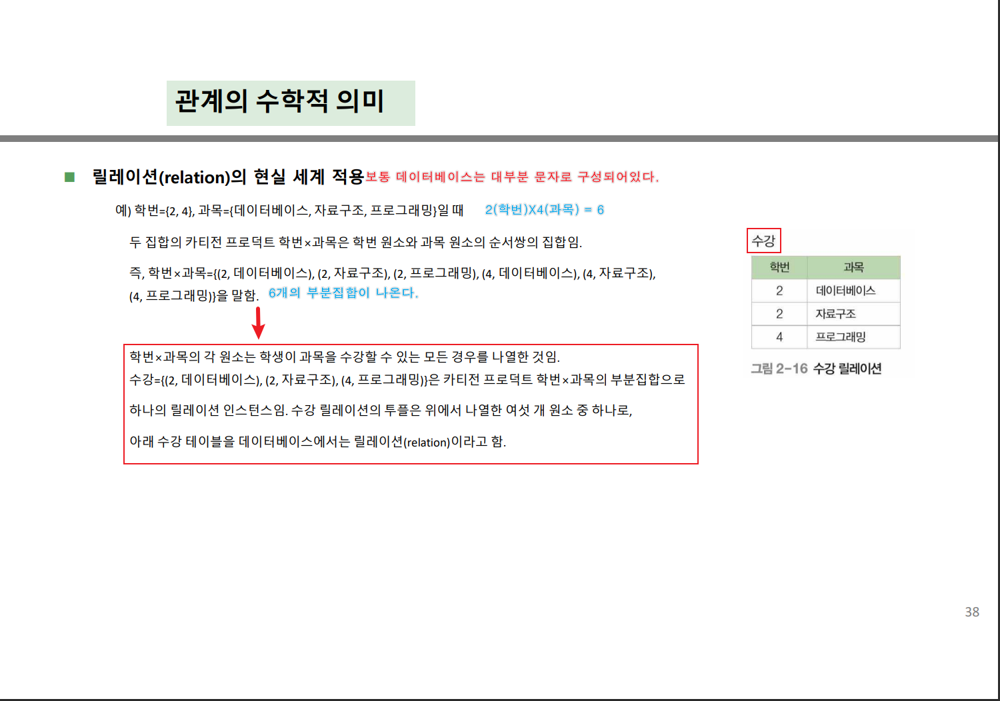
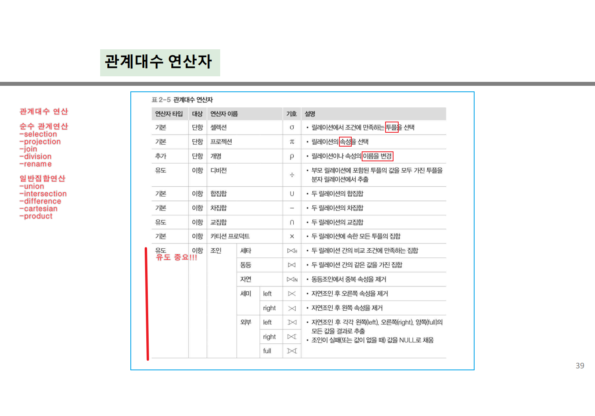
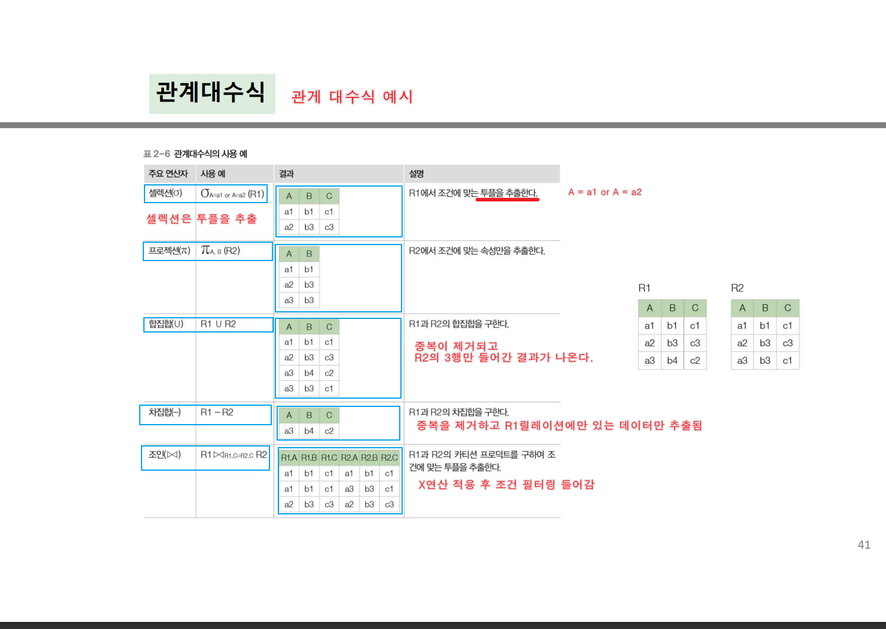

## 관계 대수 



- 기본 개념 



<details>
<summary>🐝관계의 수학적 의미, 관계대수 연산 예시🐝    </summary>
<div markdown="1">



- 위에 그림을 현실에 적용한 예시 


- 관계대수 연산자 

- 관계대수 연산예시
  
- 샐랙션은 SELECT 후 WHERE절을 사용하여 필터링을 사용해서 추출한다
  (ORDER BY는 단순히 정렬해주는 개념이다)
- 합집합은 단순하게 그냥 합집합을 해주는 개념이다 
- 교집합은 두 릴레이션이 공통으로 가자고 있는 투플을 가져온다 
- 차집합은 두 릴레이션이 공통으로 가지고 있는 투플을 빼고 한 릴레이션만 가지고 있는 투플을 가져온다
```
EX) A릴레이션-B릴레이션 = 공통으로 가지고있는 투플은 제외하고 A릴레이션에만 있는 투플 추출 
```
### 조인 ★중요★
-  하나 이상의 릴레이션이 공통속성을 기준으로 속성값이 같은 투플을 수평으로 결합하는 연삼임. 조인을 수행하기 위해서는 두 릴레이션의 조인에 참여하는 속성이 서로 동일한 도메인으로 구성되어야함. 조인 연산의 결과는 공통 속석의 속성 값이 동일한 투플 만을 반환함 
#### 조인의 종류
- 기본연산 : 1. 세타조인(THETA JOIN), 동등조인, 자연조인(NATURE JOIN)
- 확장된 조인 연산 : 세미조인, 외부조인(OUTER JOIN) 

</div>
</details>

<details>
<summary> ???     </summary>
<div markdown="1">


</div>
</details>
