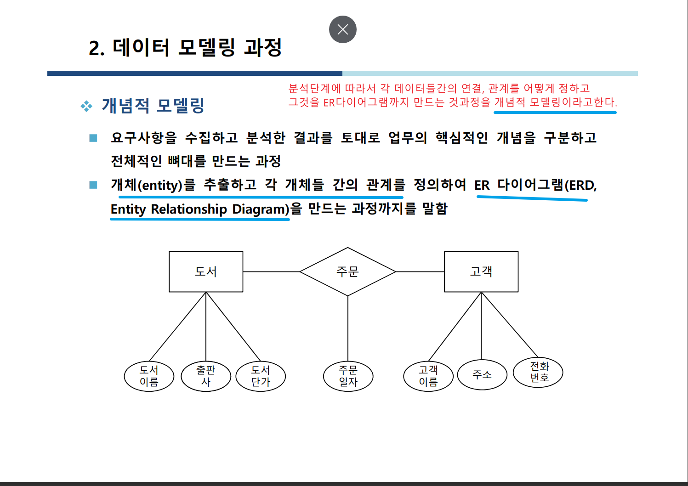
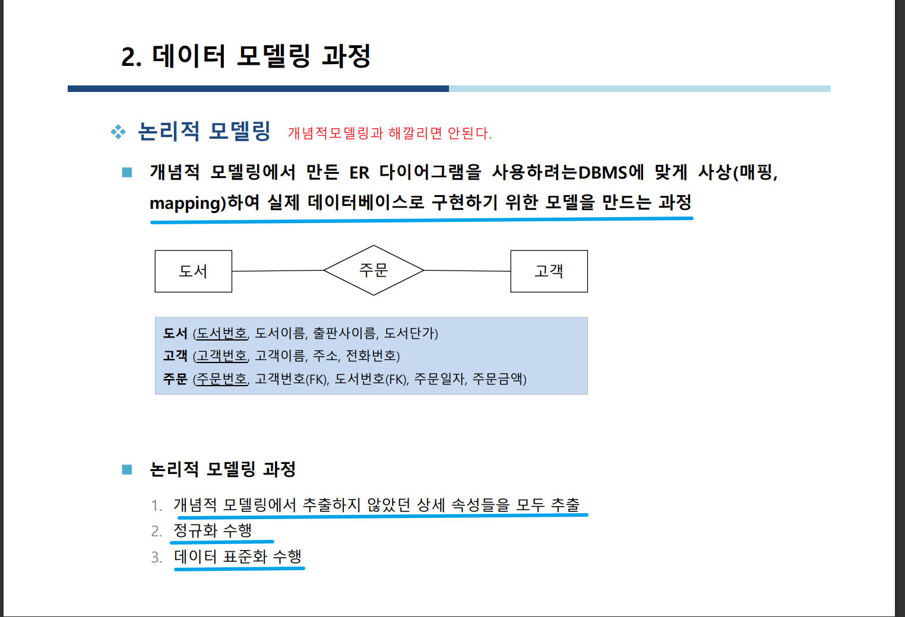
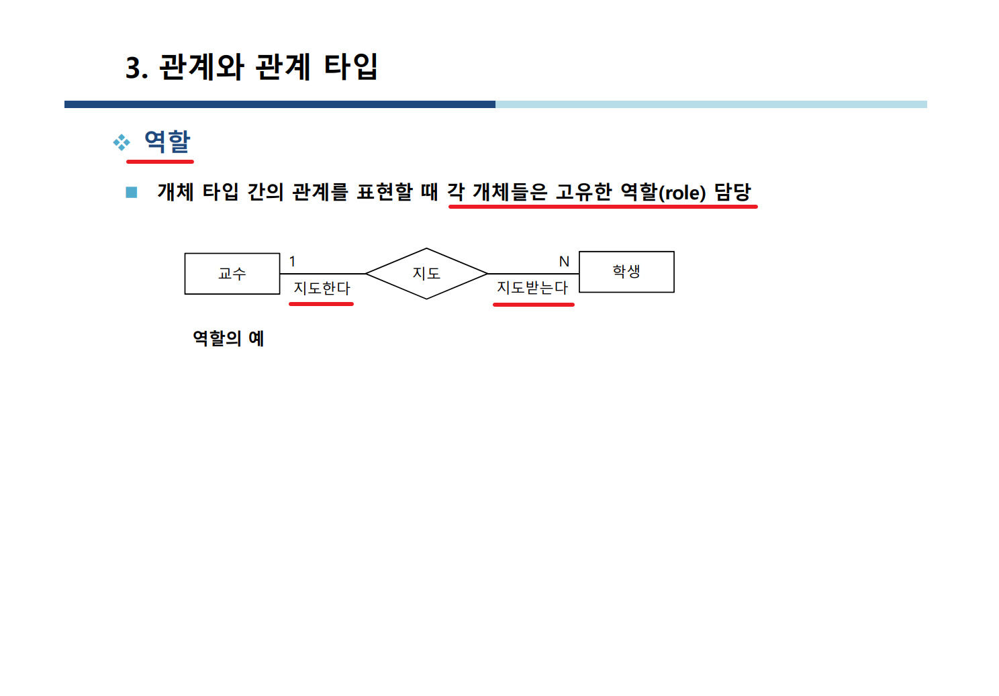

## 데이터 모델링 수업 

🐝데이터베이스모델링과정 및 생명주기  🐝    

## Tip 

- 생명주기 순서 중요 
- 각 모델링단계에서 무슨 작업하는지 파악
  

 

🐝ER모델 실습 🐝    

1. Book 도서개체
2. Customer 고객개체 ENTITY
3. Orders 주문 개체

요구사항
1. 서점이라는 데이터 베이스는 도서를 공급받아 판매한다. => 전제조건
2. 판매내역은 매일매일 기록으로 남겨야 한다.
3.  2번을 통해 ==> 고객서비스와 매출관리에 활용
4. 서점은 판매하는 도서의 도서번호, 도서이름, 출판사, 도서단가를 갖는다.
5. 구매한 도서들은 납품한 출판사와 출판사 담당자이름, 전화번호를 갖는다.
6. 고객이 책을 주문할때마다 주문번호를 기록해야 한다.
7. 고객에게 판매한 도서는 판매한 날, 고객별 주문 입금 추가로 관리해야 한다.
8. 고객들은 여러번에 걸쳐 다양한 도서를 구매할 수 있다.

---
개념설계/ 논리설계(개체와 관계를 구분하여 정리한다)
- 도서(도서번호,도서이름,출판사,도서단가) -E
- 고객(고객번호,고객이름,주소,전화번호) -E
- 출판사(출판사이름,담당자 이름,전화번호) -E

1.[X] 출판사1 : 도서 N(서점은 출판사로부터 공급한 도서만 등록하여 관리) // 1대N관계 // **독립객체(비식별자관계)**
  1.[X] 고객 N : 도서 M // N대N관계 // **식별관계** ==> 주문관계로 표현(**도서,고객 각각의 PK를 FK함**)
- 주문관계 (교차테이블)
1. 고객이 도서를 구입한 날(주문일자), 구매한 가격(주문금액)을 따로 저장한다.
2. 고객과 도서의 관게에 속성이 존재 

위에서 도서와 고객은 식별관계다. 

🐝ER모델 🐝    

