# 1.이상현상과 정규화 
# 2.트랜젝션 개념★★(굉장히 중요하다)★★

---

1. 잘못된 설계로 테이블이 생성되면 데이터 조작 작업시 이상현상이 발생할 수 있다. 
2. 이상현상은 데이터의 일관성을 손상시켜 데이터의 묵려성을 깨뜨린다. 
3. 이 문제를 해결하려면, 속성간의 함수 종속성을 파악하여 테이블을 규칙에 의해서 분해하는데 이 과정을 정규화라고 한다. 

**※정규화란?** 잘못설계된 테이블을 수정하여 데이터의 일관성과 무결성을 회복하는 프로세스 (중복성과 종속성을 제거(최소화) 데이터 베이스의 효율성과 )

---
## 종속성이란? 

### 정규화를 하기위해선 테이블의 기본키,속성간의 종속성을 파악해야한다.

종속성을 대표하는 함수적 종속 3가지 
1. 완전 함수적 종속
2. 부분 함수적 종속
3. 이행 함수적 종속 

정규화의 과정
- 제 1정규형~ 제3정규형까지 있다. 
1. 제 1정규형(1NF) : 도메인이(Domain)이 원자값(Atomic Value)만으로 되어 있는 정규형. 즉 릴레이션의 모든 속성 값이 원자 값으로만 되어 있는 정규형이다.
2. 제 2정규형(2NF) : 1NF를 만족하면서, 기본키가 아닌 모든 속성이 기본키에 대하여 완전 함수적 종속을 만족하는 정규형이다.
3. 제 3정규형(3NF) : 2NF를 만족하면서, 기본키가 아닌 모든 속성이 기본키에 대해 이행적 종속을 만족하지 않는 정규형이다. 
※ 무손실 조인 또는 종속성 보존을 저해하지 않고도 항상 3NF 설계를 얻을 수 있다. 

---

 함수 종속성 그림파일 정리  

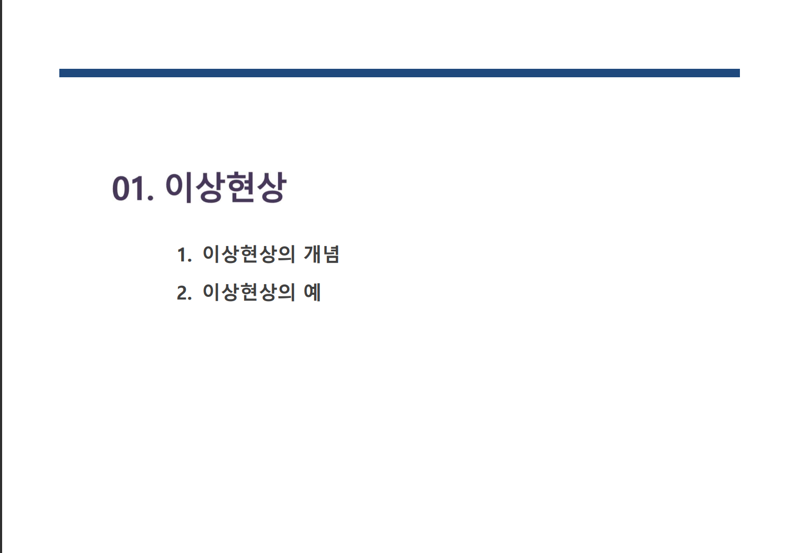
.png)
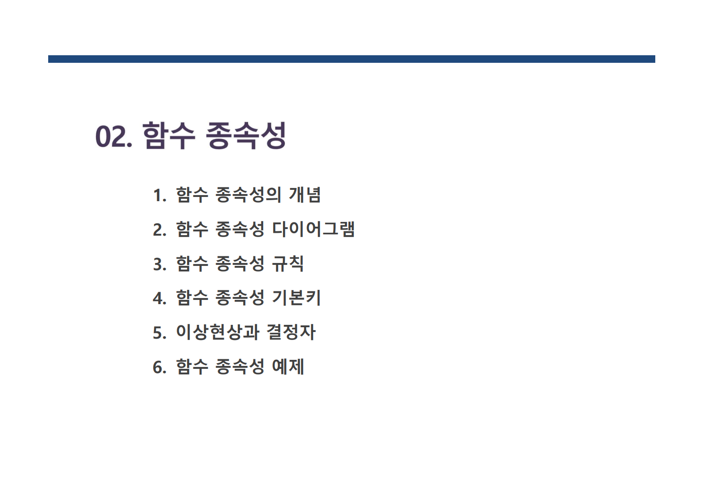
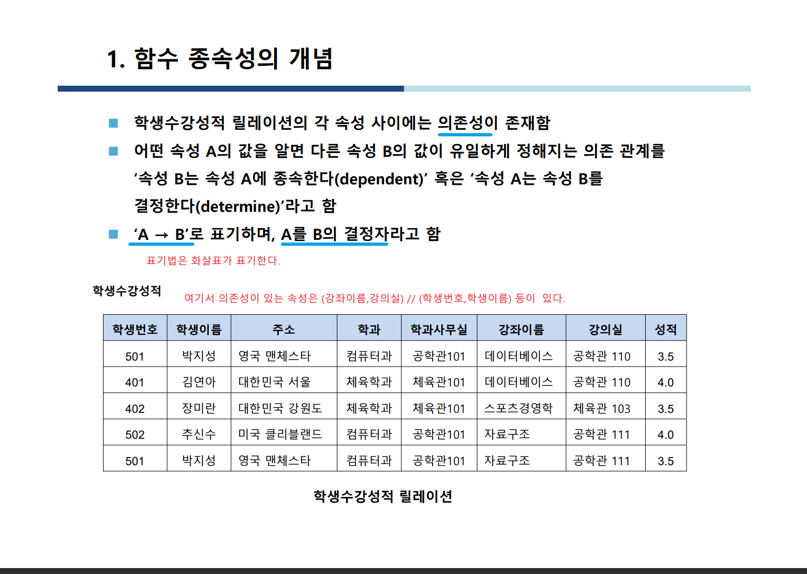
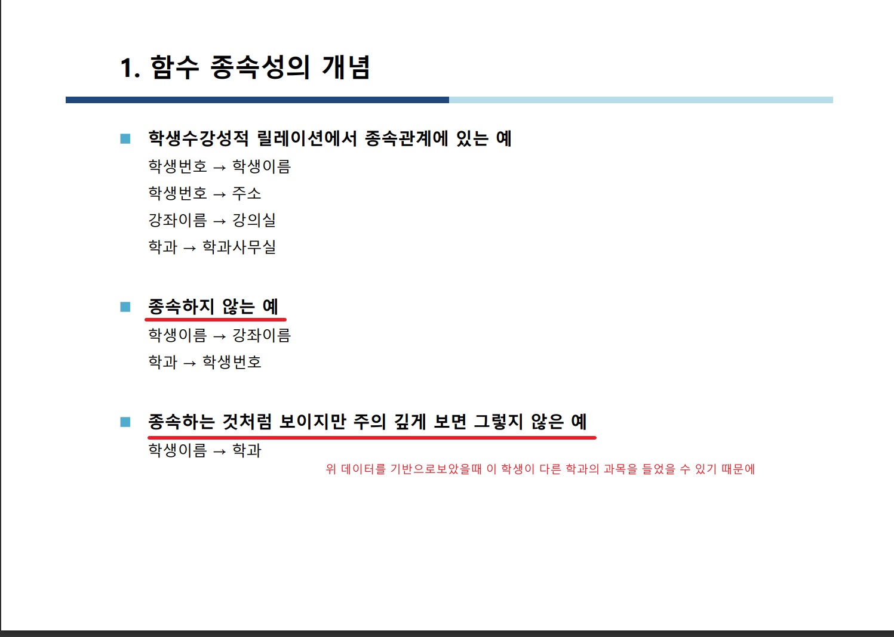
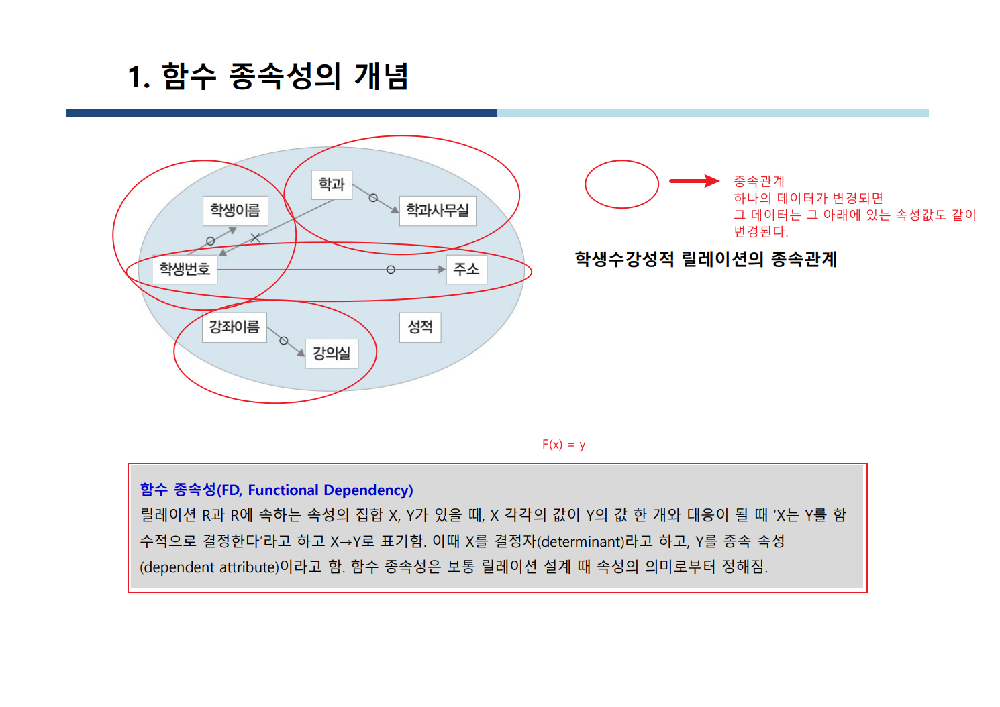
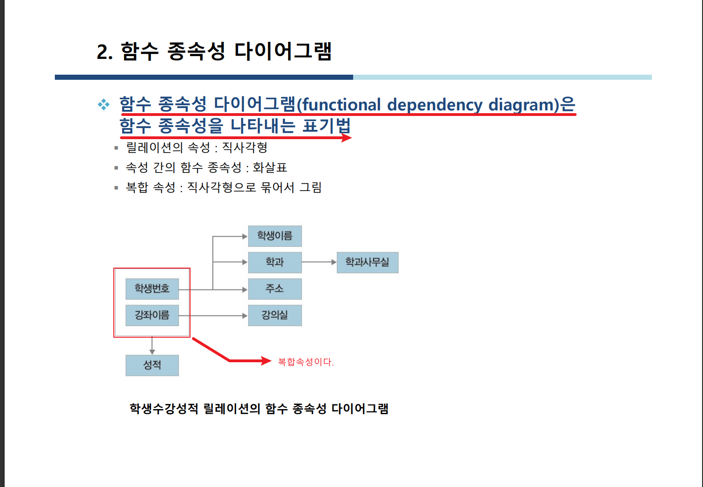
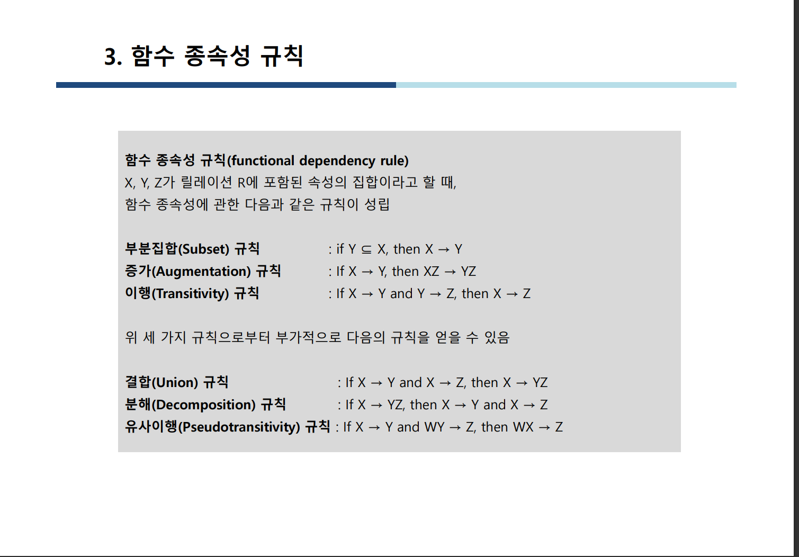
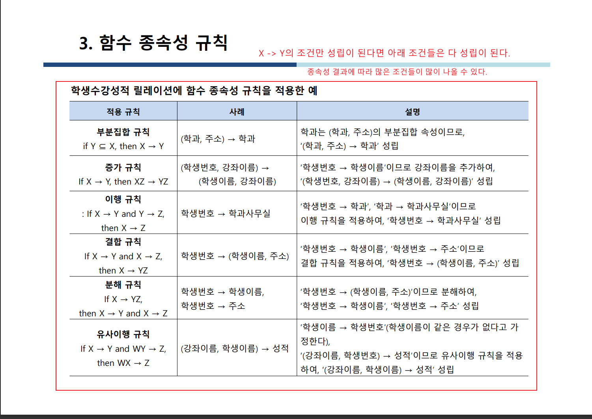
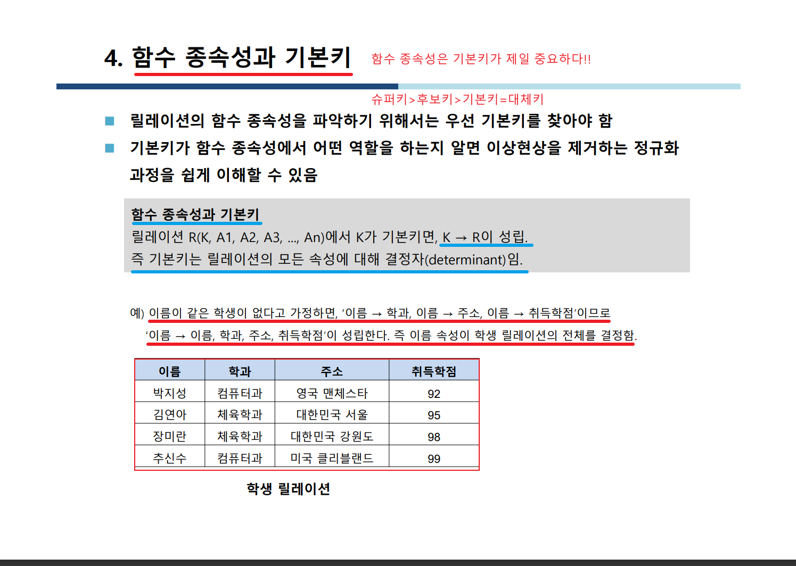
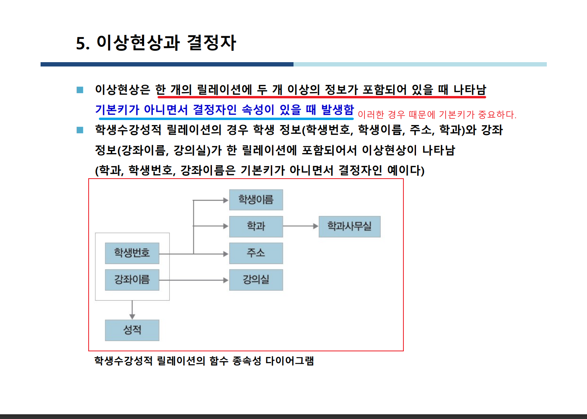
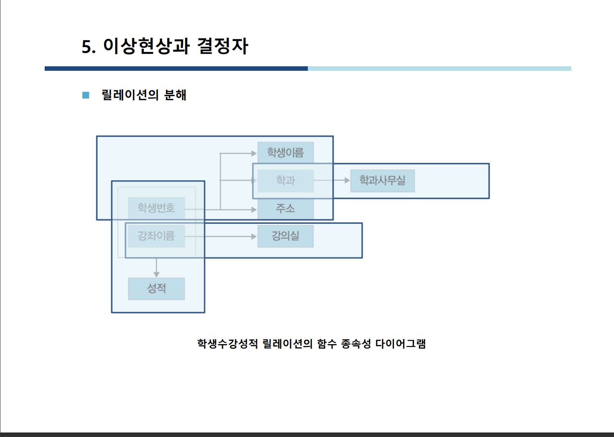
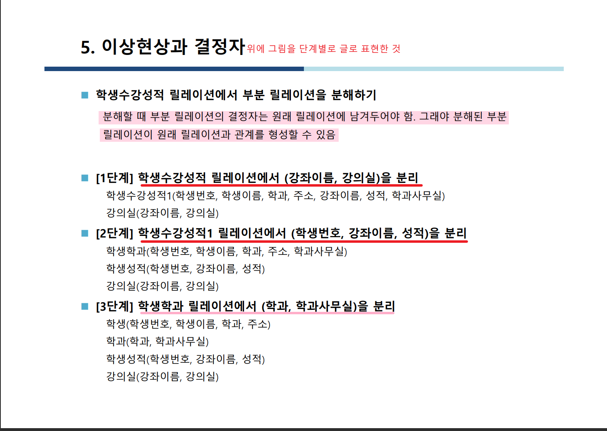
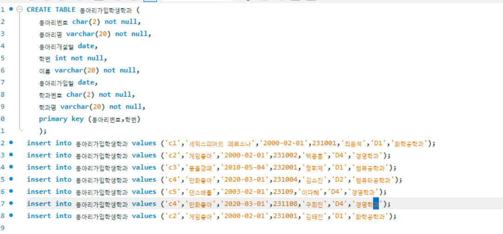
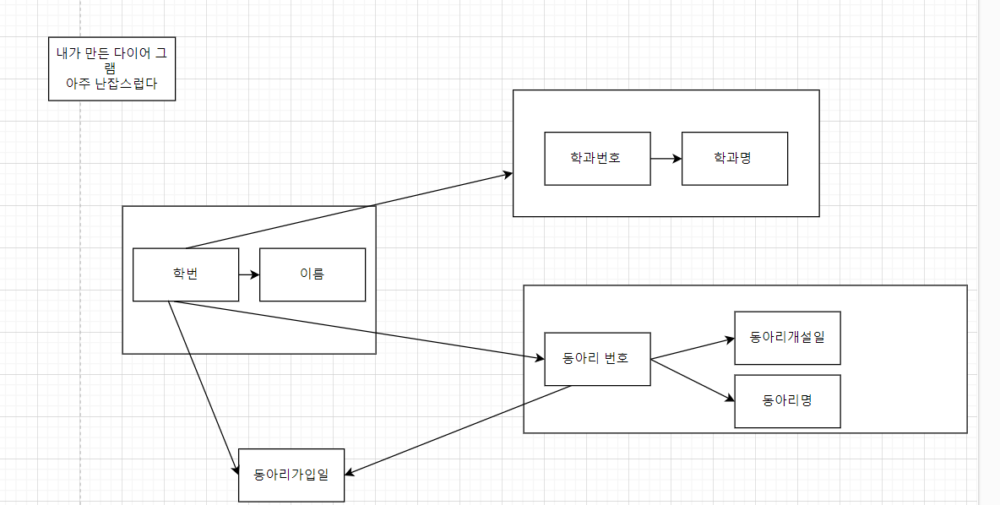
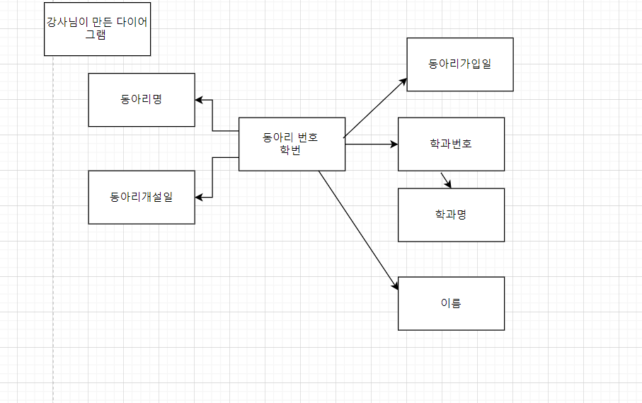

## 반정규화 

- 중복 데이터를 하나 이상의 테이블에 추가하는 데이터베이스 최적화 기술
- 이를 통해 관계형 데이터베이스에서 비용이 많이 드는 조인의 수를 줄일 수 있다. 반정규화는 정규화를 되돌린다거나 정규화되지 않음을 의미하는 것이 아니라, 
정규화 후에 적용되는 최적화기법

- 장점 : 더 적은 수의 테이블을 사용하면서 조인 개수를 줄일 수 있고, 이로 인해 검색 쿼리가 간단해지고 빠른 일기 작업의 수행으로 검색성능업 
- 단점 : 중복저장으로 더 많은 스토리지가 요구된다. 또한 데이터 불일치가 발생할수 있으며, 쓰기 작업에 추가적인 비용이 발생할 수 있다.

---
※Transaction?
- 트랜잭션(Transaction)의 사전적 의미는 거래이다
- 컴퓨터 과학 분야에서의 트랜잭션(Transaction)은 "더이상 분할이 불가능한 업무처리의 단위"를 의미한다.
 
이것은 하나의 작업을 위해 더이상 분할될 수 없는 명령들의 모음,
**즉, 한꺼번에 수행되어야 할 일련의 연산모음을 의미한다.**

출처:  - 링크 [`클릭 `](https://inpa.tistory.com/entry/MYSQL-📚-트랜잭션Transaction-이란-💯-정리) [Inpa Dev 👨‍💻:티스토리]